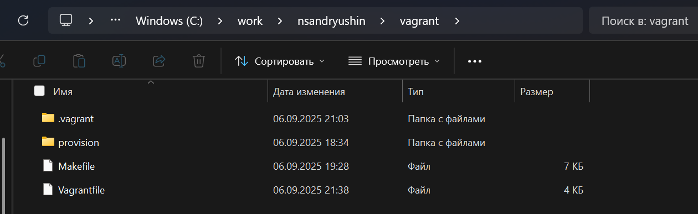

---
## Front matter
lang: ru-RU
title: Лабораторная работа
subtitle: Номер 1
author:
  - Андрюшин Н. С. 
institute:
  - Российский университет дружбы народов, Москва, Россия
date: 01 января 1970

## i18n babel
babel-lang: russian
babel-otherlangs: english

## Formatting pdf
toc: false
toc-title: Содержание
slide_level: 2
aspectratio: 169
section-titles: true
theme: metropolis
header-includes:
 - \metroset{progressbar=frametitle,sectionpage=progressbar,numbering=fraction}

## Fonts
mainfont: IBM Plex Serif
romanfont: IBM Plex Serif
sansfont: IBM Plex Sans
monofont: IBM Plex Mono
mathfont: STIX Two Math
mainfontoptions: Ligatures=Common,Ligatures=TeX,Scale=0.94
romanfontoptions: Ligatures=Common,Ligatures=TeX,Scale=0.94
sansfontoptions: Ligatures=Common,Ligatures=TeX,Scale=MatchLowercase,Scale=0.94
monofontoptions: Scale=MatchLowercase,Scale=0.94,FakeStretch=0.9
mathfontoptions:
---

# Информация

## Докладчик

:::::::::::::: {.columns align=center}
::: {.column width="70%"}

  * Андрюшин Никита Сергеевич
  * Студент
  * Российский университет дружбы народов

:::
::: {.column width="30%"}

:::
::::::::::::::

## Цель работы

Целью данной работы является приобретение практических навыков установки Rocky Linux на виртуальную машину с помощью инструмента Vagrant

## Создание папок

Для начала создадим папку с инициалами, в которой будет 2 папки, показанные на фото 

{height=60%}

## Образ диска

Поместим заранее скачаный образ в первую папку 

{height=60%}

## vagrant-rocky.pkr.hd

Создадим в той же папке файл, содержание которого перечислено на экране. Тут описано, как будет создаваться образ для vagrant 

{height=60%}

## Файл конфигурации

Создадим подпапку http, в которой поместим файл следующего содержания с конфигурацией 

{height=60%}

## Vagrantfile

Теперь добавим vagrantfile в папку vagrant 

{height=60%}

## Каталог Vagrant

Содержимое папки будет выглядеть так. Теперь создадим тут папку provision

{height=60%}

## Создание подпапок

В этой папке мы создадим 3 подпапки, показаные на фото 

{height=60%}

## Файл заглушка

В каждую папку добавим файл заглушку со следующим содержанием 

{height=60%}

## 01-user.sh

В папку default добавим следующий файл 

{height=60%}

## 01-hostname.sh

И этот файл 

{height=60%}

## первый файл

Добавим также 2 файла в папку сервера. Первый файл (рис. 

{height=60%}

## Второй файл

И второй файл 

{height=60%}

## инициализируем packer

Теперь инициализируем packer

{height=60%}

## билд образа

И сделаем билд образа

{height=60%}

## добавление образа в vagrant

После этого добавим его в vagrant 

{height=60%}

## запуск сервера

Запустим через вагрант ВМ сервера

{height=60%}

## запуск клиента

И запустим еще клиент

{height=60%}

## Вход через GUI

Убедимся, что они оба работают, через графический интерфейс. Войдём туда под пользователем vagrant 

{height=60%}

## Логин на сервере

Теперь попробуем зайти на сервер через ssh, после чего авторизируемся от имени собственного пользователя, и отключимся 

{height=60%}

## Логин на клиенте

Сделаем то же самое для клиента 

{height=60%}

## Завершение работы

Выключим обе машины

{height=60%}

## Выводы

В результате выполнения лабораторной работы были получены навыки работы с vagrant
