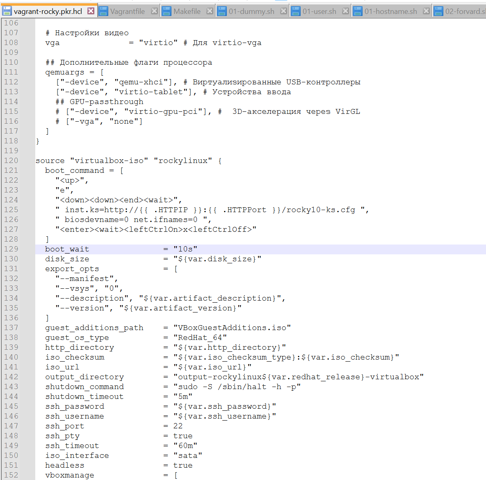

---
## Front matter
title: "Отчёт о лабораторной работе"
subtitle: "Лабораторная работа 1"
author: "Андрюшин Никита Сергеевич"

## Generic otions
lang: ru-RU
toc-title: "Содержание"

## Bibliography
bibliography: bib/cite.bib
csl: pandoc/csl/gost-r-7-0-5-2008-numeric.csl

## Pdf output format
toc: true # Table of contents
toc-depth: 2
lof: true # List of figures
lot: true # List of tables
fontsize: 12pt
linestretch: 1.5
papersize: a4
documentclass: scrreprt
## I18n polyglossia
polyglossia-lang:
  name: russian
  options:
	- spelling=modern
	- babelshorthands=true
polyglossia-otherlangs:
  name: english
## I18n babel
babel-lang: russian
babel-otherlangs: english
## Fonts
mainfont: IBM Plex Serif
romanfont: IBM Plex Serif
sansfont: IBM Plex Sans
monofont: IBM Plex Mono
mathfont: STIX Two Math
mainfontoptions: Ligatures=Common,Ligatures=TeX,Scale=0.94
romanfontoptions: Ligatures=Common,Ligatures=TeX,Scale=0.94
sansfontoptions: Ligatures=Common,Ligatures=TeX,Scale=MatchLowercase,Scale=0.94
monofontoptions: Scale=MatchLowercase,Scale=0.94,FakeStretch=0.9
mathfontoptions:
## Biblatex
biblatex: true
biblio-style: "gost-numeric"
biblatexoptions:
  - parentracker=true
  - backend=biber
  - hyperref=auto
  - language=auto
  - autolang=other*
  - citestyle=gost-numeric
## Pandoc-crossref LaTeX customization
figureTitle: "Рис."
tableTitle: "Таблица"
listingTitle: "Листинг"
lofTitle: "Список иллюстраций"
lotTitle: "Список таблиц"
lolTitle: "Листинги"
## Misc options
indent: true
header-includes:
  - \usepackage{indentfirst}
  - \usepackage{float} # keep figures where there are in the text
  - \floatplacement{figure}{H} # keep figures where there are in the text
---

# Цель работы

Целью данной работы является приобретение практических навыков установки Rocky Linux на виртуальную машину с помощью инструмента Vagrant

# Выполнение лабораторной работы

Для начала создадим папку с инициалами, в которой будет 2 папки, показанные на фото (рис. [-@fig:001]).

{#fig:001}

Поместим заранее скачаный образ в первую папку (рис. [-@fig:002]).

{#fig:002}

Создадим в той же папке файл, содержание которого перечислено на экране. Тут описано, как будет создаваться образ для vagrant (рис. [-@fig:003]).

{#fig:003}

Создадим подпапку http, в которой поместим файл следующего содержания с конфигурацией (рис. [-@fig:004]).

{#fig:004}

Теперь добавим vagrantfile в папку vagrant (рис. [-@fig:005]).

{#fig:005}

Содержимое папки будет выглядеть так. Теперь создадим тут папку provision (рис. [-@fig:006]).

{#fig:006}

В этой папке мы создадим 3 подпапки, показаные на фото (рис. [-@fig:007]).

{#fig:007}

В каждую папку добавим файл заглушку со следующим содержанием (рис. [-@fig:008]).

{#fig:008}

В папку default добавим следующий файл (рис. [-@fig:009]).

{#fig:009}

И этот файл (рис. [-@fig:010]).

{#fig:010}

Добавим также 2 файла в папку сервера. Первый файл (рис. [-@fig:011]).

{#fig:011}

И второй файл (рис. [-@fig:012]).

{#fig:012}

Теперь инициализируем packer (рис. [-@fig:013]).

{#fig:013}

И сделаем билд образа (рис. [-@fig:014]).

{#fig:014}

После этого добавим его в vagrant (рис. [-@fig:015]).

{#fig:015}

Запустим через вагрант ВМ сервера (рис. [-@fig:016]).

{#fig:016}

И запустим еще клиент (рис. [-@fig:017]).

{#fig:017}

Убедимся, что они оба работают, через графический интерфейс. Войдём туда под пользователем vagrant (рис. [-@fig:018]).

{#fig:018}

Теперь попробуем зайти на сервер через ssh, после чего авторизируемся от имени собственного пользователя, и отключимся (рис. [-@fig:019]).

{#fig:019}

Сделаем то же самое для клиента (рис. [-@fig:020]).

{#fig:020}

Выключим обе машины (рис. [-@fig:021]).

{#fig:021}

# Выводы

В результате выполнения лабораторной работы были получены навыки работы с vagrant

# Список литературы{.unnumbered}

::: {#refs}
:::
