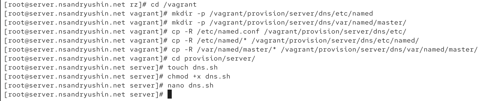

---
## Front matter
lang: ru-RU
title: Лабораторная работа
subtitle: Номер 2
author:
  - Андрюшин Н. С. 
institute:
  - Российский университет дружбы народов, Москва, Россия
date: 01 января 1970

## i18n babel
babel-lang: russian
babel-otherlangs: english

## Formatting pdf
toc: false
toc-title: Содержание
slide_level: 2
aspectratio: 169
section-titles: true
theme: metropolis
header-includes:
 - \metroset{progressbar=frametitle,sectionpage=progressbar,numbering=fraction}

## Fonts
mainfont: IBM Plex Serif
romanfont: IBM Plex Serif
sansfont: IBM Plex Sans
monofont: IBM Plex Mono
mathfont: STIX Two Math
mainfontoptions: Ligatures=Common,Ligatures=TeX,Scale=0.94
romanfontoptions: Ligatures=Common,Ligatures=TeX,Scale=0.94
sansfontoptions: Ligatures=Common,Ligatures=TeX,Scale=MatchLowercase,Scale=0.94
monofontoptions: Scale=MatchLowercase,Scale=0.94,FakeStretch=0.9
mathfontoptions:
---

# Информация

## Докладчик

:::::::::::::: {.columns align=center}
::: {.column width="70%"}

  * Андрюшин Никита Сергеевич
  * Студент
  * Российский университет дружбы народов

:::
::: {.column width="30%"}

:::
::::::::::::::

## Цель

Приобретение практических навыков по установке и конфигурированию DNS-сервера, усвоение принципов работы системы доменных имён.

## Запуск ВМ

Для начала запустим виртуальную машину через vagrant 

{height=60%}

## Скачивание пакетов

Теперь скачаем пакет bind utils

{height=60%}

## dig ya.ru

Используем команду dig для проверки сервисов яндекса

{height=60%}

## Файлы конфигурации

Посморим на содержание файлов конфигурации dns в etc

{height=60%}

## named.ca

Просморим теперь файл named.ca

{height=60%}

## named.localhost и named.loopback

Содержимое named.localhost и named.loopback

{height=60%}

## Запуск named

Запустим теперь named и осуществим снова dig yandex.ru 

{height=60%}

## eth0

Теперь настроим порт eth0

{height=60%}

## named.conf

Откроем и отредактируем named.conf

{height=60%}

## Правила фаервола

Установим правила фаервола 

{height=60%}

## перемещение файла

Теперь переместим файл с настройкой конфига

{height=60%}

## Редактирование файла

И отредактируем наш файл под наши параметры

{height=60%}

## Файл зон

То же самое сделаем с файлом зон 

{height=60%}

## Создание папок и настроек днс

Создадим папки с настройками днс 

{height=60%}

## nsandryushin.net

Отредактируем файл nsandryushin.net 

{height=60%}

## Папка rz

Теперь посмотрим на файлы из папки rz 

{height=60%}

## Редактирование файла

Отредактируем следующим образом 

{height=60%}

## Selinux

Настроим Selinux 

{height=60%}

## dig

Через dig попробуем подключиться к собственному днс 

{height=60%}

## Конфиг вагрант

Оформим нашу работу как конфигурацию для вагранта

{height=60%}

## скрипт

И напишем скрипт для загрузки вагранта 

{height=60%}

## vagrantfile

И в vagrantfile будем загружать этот скрипт

{height=60%}

## Выводы

В результате выполнения работы были получены навыки настройки днс
