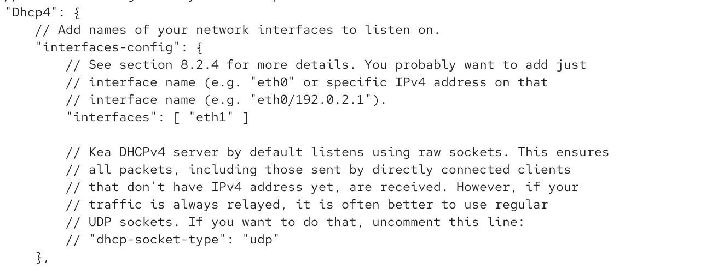
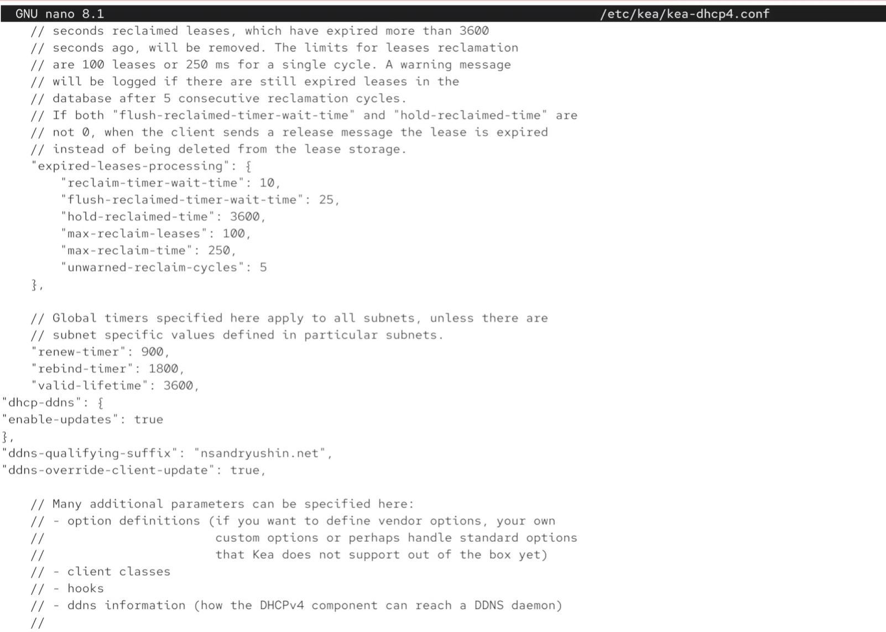

---
## Front matter
lang: ru-RU
title: Лабораторная работа
subtitle: Номер 3
author:
  - Андрюшин Н. С. 
institute:
  - Российский университет дружбы народов, Москва, Россия
date: 01 января 1970

## i18n babel
babel-lang: russian
babel-otherlangs: english

## Formatting pdf
toc: false
toc-title: Содержание
slide_level: 2
aspectratio: 169
section-titles: true
theme: metropolis
header-includes:
 - \metroset{progressbar=frametitle,sectionpage=progressbar,numbering=fraction}
 
## Fonts
mainfont: IBM Plex Serif
romanfont: IBM Plex Serif
sansfont: IBM Plex Sans
monofont: IBM Plex Mono
mathfont: STIX Two Math
mainfontoptions: Ligatures=Common,Ligatures=TeX,Scale=0.94
romanfontoptions: Ligatures=Common,Ligatures=TeX,Scale=0.94
sansfontoptions: Ligatures=Common,Ligatures=TeX,Scale=MatchLowercase,Scale=0.94
monofontoptions: Scale=MatchLowercase,Scale=0.94,FakeStretch=0.9
mathfontoptions:
---

# Информация

## Докладчик

:::::::::::::: {.columns align=center}
::: {.column width="70%"}

  * Андрюшин Никита Сергеевич
  * Студент
  * Российский университет дружбы народов

:::
::: {.column width="30%"}

:::
::::::::::::::

## Цель работы

Приобретение практических навыков по установке и конфигурированию DHCP-сервера.

## Запуск сервера

{height=60%}

## Установка kea

{height=60%}

## Бекап конфига

{height=60%}

## Редактирование конфига

{height=60%}

## Настройка подсети

{height=60%}

## Установка интерфейса

{height=60%}

## Загрузка конфига

{height=60%}

## Перезагрузка даемонов

{height=60%}

## Редактирование fz

{height=60%}

## rz

{height=60%}

## Пинг dhcp

{height=60%}

## firewall и selinux

{height=60%}

## Логи сервера 

{height=60%}

## Запуск dhcp

{height=60%}

## Сверка по логу

{height=60%}

## Скрипт для клиента 

{height=60%}

## Vagrantfile

{height=60%}

## Запуск клиента

{height=60%}

## ifconfig

{height=60%}

## Таблица с назначениями

{height=60%}

## Ключ sha512 

{height=60%}

## Добавление ключа

{height=60%}

## Обновление файла

{height=60%}

## Применение изменений

{height=60%}

## Порядок монтирования 

{height=60%}

## Смена прав файла

{height=60%}

## Изменение конфигурации

{height=60%}

## Перезапуск ddns

{height=60%}

## Добавление информации о ddns

{height=60%}

## Перезапуск службы с приминением изменений 

{height=60%}

## Обновление данных 

{height=60%}

## dig 

{height=60%}

## Перенос конфигурации

{height=60%}

## Скрипт vagrant

{height=60%}

## Vagtantfile

{height=60%}

## Выводы

в результате выполнения работы были получены навыки настройки dhcp
