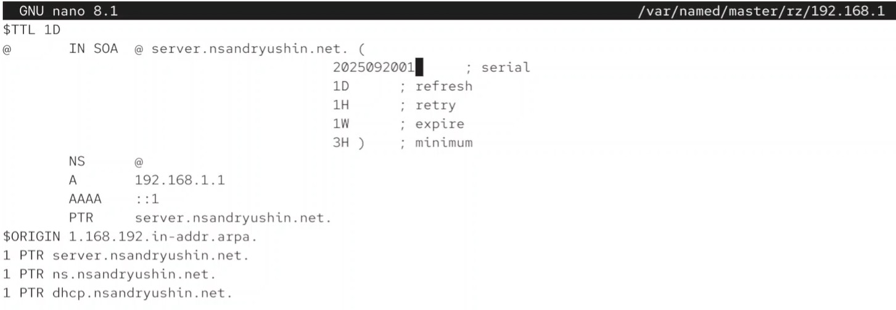
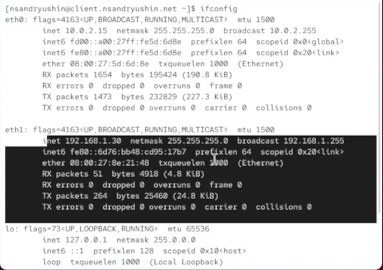
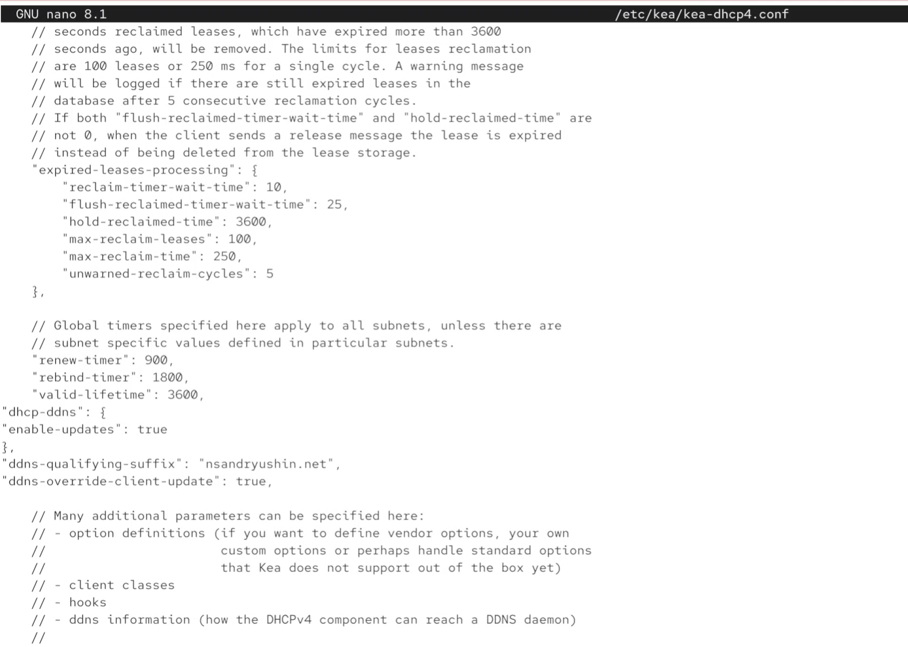
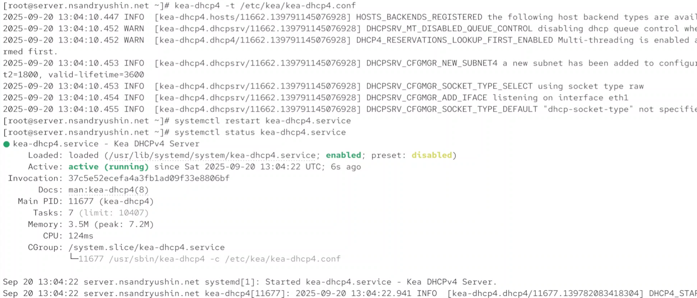
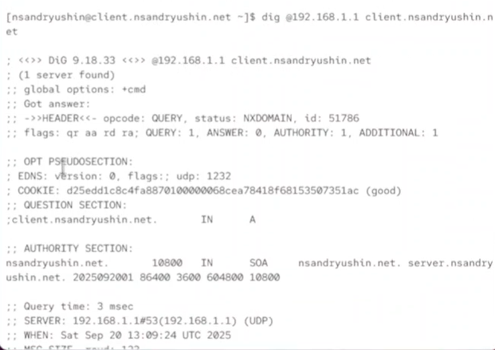

---
## Front matter
title: "Отчёт о лабораторной работе"
subtitle: "Лабораторная работа 3"
author: "Андрюшин Никита Сергеевич"

## Generic otions
lang: ru-RU
toc-title: "Содержание"

## Bibliography
bibliography: bib/cite.bib
csl: pandoc/csl/gost-r-7-0-5-2008-numeric.csl

## Pdf output format
toc: true # Table of contents
toc-depth: 2
lof: true # List of figures
lot: true # List of tables
fontsize: 12pt
linestretch: 1.5
papersize: a4
documentclass: scrreprt
## I18n polyglossia
polyglossia-lang:
  name: russian
  options:
	- spelling=modern
	- babelshorthands=true
polyglossia-otherlangs:
  name: english
## I18n babel
babel-lang: russian
babel-otherlangs: english
## Fonts
mainfont: IBM Plex Serif
romanfont: IBM Plex Serif
sansfont: IBM Plex Sans
monofont: IBM Plex Mono
mathfont: STIX Two Math
mainfontoptions: Ligatures=Common,Ligatures=TeX,Scale=0.94
romanfontoptions: Ligatures=Common,Ligatures=TeX,Scale=0.94
sansfontoptions: Ligatures=Common,Ligatures=TeX,Scale=MatchLowercase,Scale=0.94
monofontoptions: Scale=MatchLowercase,Scale=0.94,FakeStretch=0.9
mathfontoptions:
## Biblatex
biblatex: true
biblio-style: "gost-numeric"
biblatexoptions:
  - parentracker=true
  - backend=biber
  - hyperref=auto
  - language=auto
  - autolang=other*
  - citestyle=gost-numeric
## Pandoc-crossref LaTeX customization
figureTitle: "Рис."
tableTitle: "Таблица"
listingTitle: "Листинг"
lofTitle: "Список иллюстраций"
lotTitle: "Список таблиц"
lolTitle: "Листинги"
## Misc options
indent: true
header-includes:
  - \usepackage{indentfirst}
  - \usepackage{float} # keep figures where there are in the text
  - \floatplacement{figure}{H} # keep figures where there are in the text
---

# Цель работы

Приобретение практических навыков по установке и конфигурированию DHCP-сервера.

# Выполнение лабораторной работы

Для начала запустим сервер через vagrant (рис. [-@fig:001]).

{#fig:001 width=70%}

Зайдём под рутом и установим пакет для настройки dhcp - kea (рис. [-@fig:002]).

{#fig:002 width=70%}

Перед изменением конфигурационного файла, на всякий случай сделаем бекап и отредактируем его (рис. [-@fig:003]).

{#fig:003 width=70%}

Мы поменяем изначальные данные на свои - изменим доменное имя на собственное, а также поставим ip на ip нашей машины - 192.168.1.1 (рис. [-@fig:004]).

{#fig:004 width=70%}

Спустимся ниже и настроим свою подсеть следующим образом (рис. [-@fig:005]).

{#fig:005 width=70%}

И установим интерфейс для dhcp как eth1 (рис. [-@fig:006]).

{#fig:006 width=70%}

Загрузим конфиг и убедимся, что нигде нет критическиз ошибок (рис. [-@fig:007]).

{#fig:007 width=70%}

Перезагрузим системные даемоны (рис. [-@fig:008]).

{#fig:008 width=70%}

И слегка отредактируем наш файл с прошлой лабораторной работы в папке fz, добавив запись о dhcp (рис. [-@fig:009]).

{#fig:009 width=70%}

То же самое сделаем с rz (рис. [-@fig:010]).

{#fig:010 width=70%}

Перезагрузим сервер ДНС и убедимся, что мы можем пингануть dhcp сервер (рис. [-@fig:011]).

{#fig:011 width=70%}

Теперь настроим firewall и обновим метки selinux (рис. [-@fig:012]).

{#fig:012 width=70%}

Убедимся по логам, что сервер ДНС работает и не выдаёт ошибок (рис. [-@fig:013]).

{#fig:013 width=70%}

Теперь запускаем dhcp сервер (рис. [-@fig:014]).

{#fig:014 width=70%}

Посмотрим на лог и убедимся, что запуск был успешен (рис. [-@fig:015]).

{#fig:015 width=70%}

Далее убедимся в том, что в нашей папке клиента в vagrant представлен скрипт следующего содержания для настройки сети, берущей свой ip по dhcp (рис. [-@fig:016]).

{#fig:016 width=70%}

В Vagrantfile мы убедимся, что этот скрипт прописан для запуска (рис. [-@fig:017]).

{#fig:017 width=70%}

Когда приготовления завершены, мы можем запустить клиент (рис. [-@fig:018]).

{#fig:018 width=70%}

Зайдя в клиент, через ifconfig убедимся, что айпи был получен с сервера. Это так, айпи назначился как 192.168.1.30 (рис. [-@fig:019`]).

{#fig:019 width=70%}

Информация о назначении айпи также хранится в файле /var/lib/kea/kea-leases4.csv на сервере (рис. [-@fig:020]).

{#fig:020 width=70%}

Теперь создадим ключ sha512 и убедимся в том, что он создался (рис. [-@fig:021]).

{#fig:021 width=70%}

Этот ключ добавим в /etc/named.conf (рис. [-@fig:022]).

{#fig:022 width=70%}

Обновим файл /etc/named/nsandryushin.net, добавив туда dhcp (рис. [-@fig:023]).

{#fig:023 width=70%}

Проверим корректность конфига на синтаксис и перезапустим DNS службу, а также создадим файл с ключом (рис. [-@fig:024]).

{#fig:024 width=70%}

В созданный файл вставим ключ, который мы сгенерировали ранее (рис. [-@fig:025]).

{#fig:025 width=70%}

Поменяем права и владельца созданного файла, предоставив его системному пользователю службы (рис. [-@fig:026]).

{#fig:026 width=70%}

Теперь заполним файл конфигурации ddns, который перепишм с нуля согласно данному шаблону, поменяв имя на свой домен (рис. [-@fig:027]).

{#fig:027 width=70%}

Предоставим этот файл во владение системному пользователю, а так же загрузим эту конфигурацию, и убедимся, что она загружена успешно. После этого перезапустим ddns службу (рис. [-@fig:028]).

{#fig:028 width=70%}

Теперь добавим информацию о ddns в наш файл с конфигурацией dhcp (рис. [-@fig:029]).

{#fig:029 width=70%}

Вновь загрузим конфигурацию и перезапустим службу dhcp (рис. [-@fig:030]).

{#fig:030 width=70%}

Теперь на клиенте перезапустим интернет, чтобы обновить данные (рис. [-@fig:031]).

{#fig:031 width=70%}

Теперь через dig получим информацию о нашем сервере (рис. [-@fig:032]).

{#fig:032 width=70%}

Теперь переместим данные созданных ранее конфигураций в вагрант, после чего создадим скрипт (рис. [-@fig:033]).

{#fig:033 width=70%}

В скрипте напишем алгоритм настройки dhcp (рис. [-@fig:034]).

{#fig:034 width=70%}

И добавим запуск скрипта в Vagrantfile (рис. [-@fig:035]).

{#fig:035 width=70%}

# Выводы

в результате выполнения работы были получены навыки настройки dhcp
