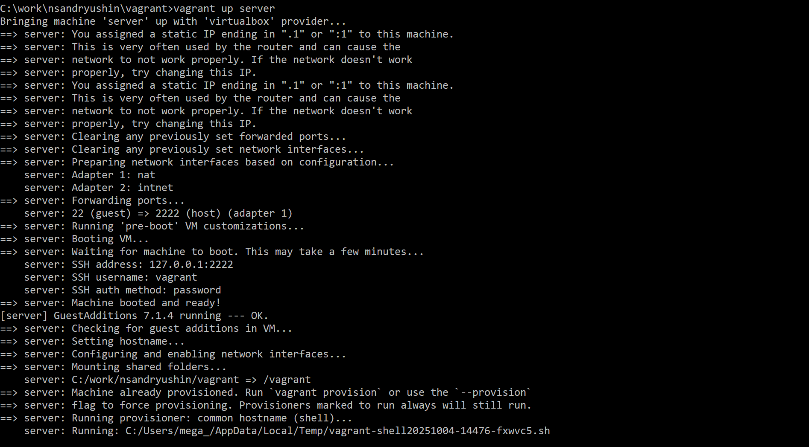
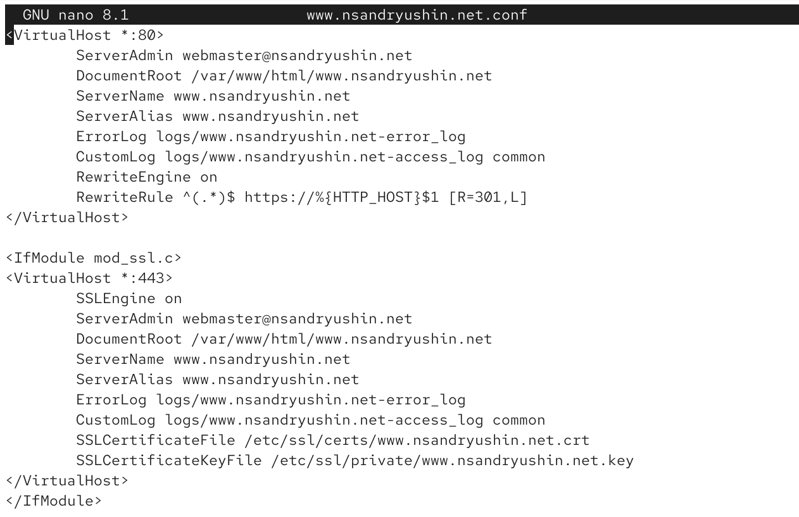
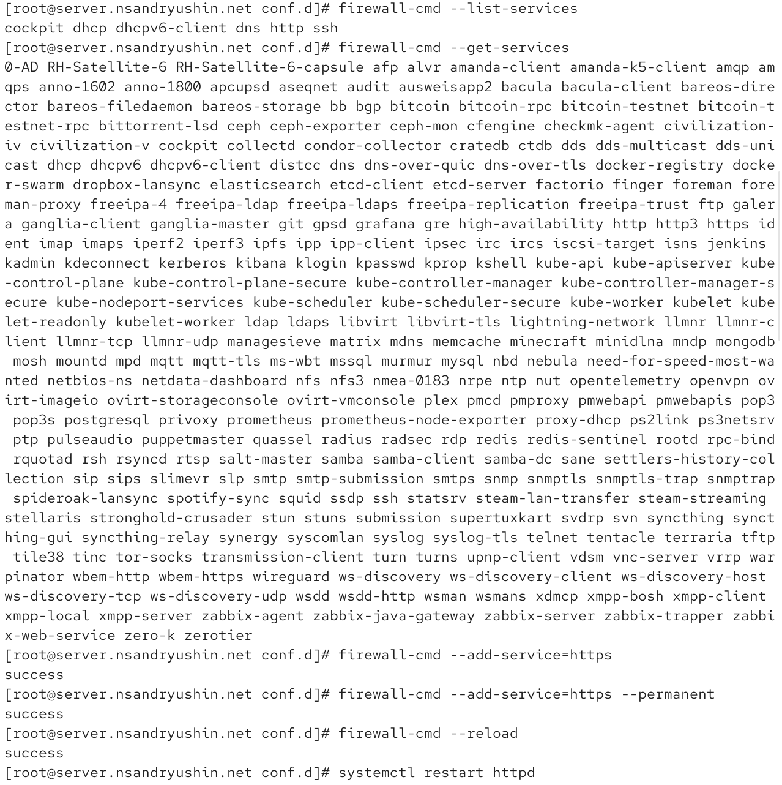
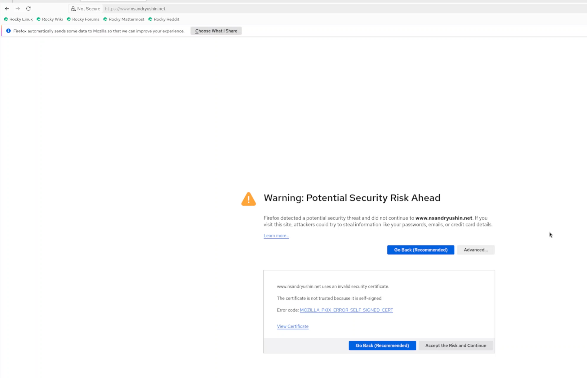
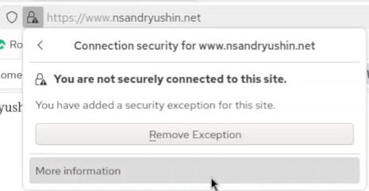
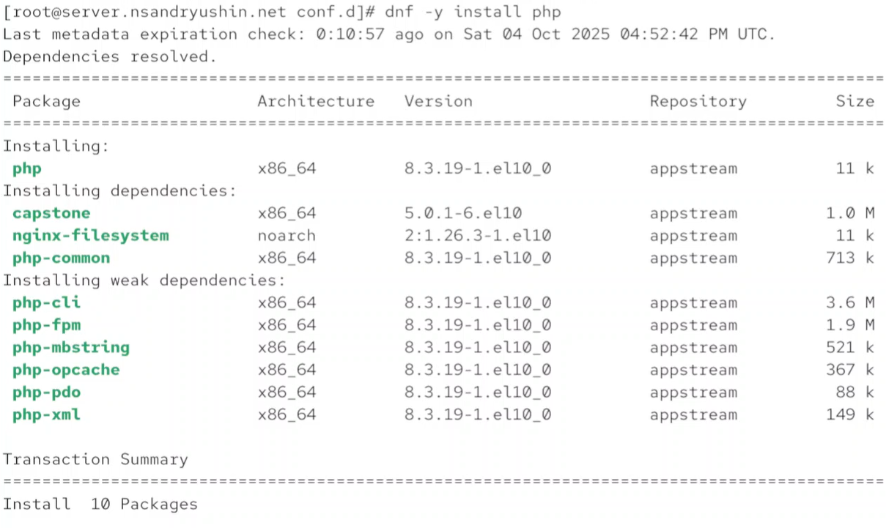
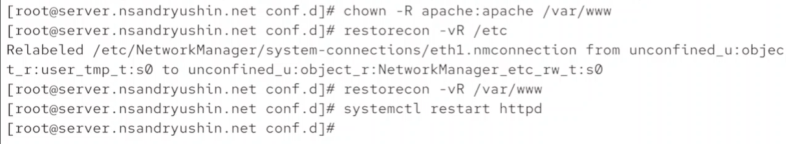
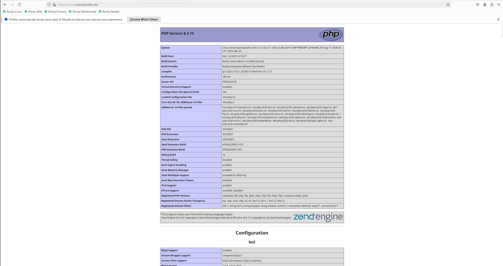

---
## Front matter
title: "Отчёт о лабораторной работе"
subtitle: "Лабораторная работа 5"
author: "Андрюшин Никита Сергеевич"

## Generic otions
lang: ru-RU
toc-title: "Содержание"

## Bibliography
bibliography: bib/cite.bib
csl: pandoc/csl/gost-r-7-0-5-2008-numeric.csl

## Pdf output format
toc: true # Table of contents
toc-depth: 2
lof: true # List of figures
lot: true # List of tables
fontsize: 12pt
linestretch: 1.5
papersize: a4
documentclass: scrreprt
## I18n polyglossia
polyglossia-lang:
  name: russian4
  options:
	- spelling=modern
	- babelshorthands=true
polyglossia-otherlangs:
  name: english
## I18n babel
babel-lang: russian
babel-otherlangs: english
## Fonts
mainfont: IBM Plex Serif
romanfont: IBM Plex Serif
sansfont: IBM Plex Sans
monofont: IBM Plex Mono
mathfont: STIX Two Math
mainfontoptions: Ligatures=Common,Ligatures=TeX,Scale=0.94
romanfontoptions: Ligatures=Common,Ligatures=TeX,Scale=0.94
sansfontoptions: Ligatures=Common,Ligatures=TeX,Scale=MatchLowercase,Scale=0.94
monofontoptions: Scale=MatchLowercase,Scale=0.94,FakeStretch=0.9
mathfontoptions:
## Biblatex
biblatex: true
biblio-style: "gost-numeric"
biblatexoptions:
  - parentracker=true
  - backend=biber
  - hyperref=auto
  - language=auto
  - autolang=other*
  - citestyle=gost-numeric
## Pandoc-crossref LaTeX customization
figureTitle: "Рис."
tableTitle: "Таблица"
listingTitle: "Листинг"
lofTitle: "Список иллюстраций"
lotTitle: "Список таблиц"
lolTitle: "Листинги"
## Misc options
indent: true
header-includes:
  - \usepackage{indentfirst}
  - \usepackage{float} # keep figures where there are in the text
  - \floatplacement{figure}{H} # keep figures where there are in the text
---

# Цель работы

Приобретение практических навыков по расширенному конфигурированию HTTP-сервера Apache в части безопасности и возможности использования PHP.

# Выполнение лабораторной работы

Для начала запустим наш сервер через vagrant (рис. [-@fig:001]).

{#fig:001}

Далее нам необходимо создать сертификат. Создадим его в созданной нами папке /etc/pki/tls/private, который сделаем симлинком на папку /etc/ssl/private. После создания сертификата, скопируем его в /etc/ssl/certs (рис. [-@fig:002]).

{#fig:002}

Перейдём в /etc/httpd/conf.d и отредактируем конфигурационный файл www.nsandryushin.net.conf (рис. [-@fig:003]).

{#fig:003}

Изменим его на следующее содержание, добавив поддержку https (рис. [-@fig:004]).

{#fig:004}

Теперь с помощью фаервола разрешим работу с https и пеезапустим службу httpd (рис. [-@fig:005]).

{#fig:005}

Теперь перейдём на машину клиента. Попробуем войти на наш сайт www.nsandryushin.net и увидим, что браузер предупреждает о том, что соединение незащищено. Тем не менее, подтверждаем переход на сайт (рис. [-@fig:006]).

{#fig:006}

Как видим, соединение к сайту происходит по https (рис. [-@fig:007]).

{#fig:007}

Посмотрим на сертификат, и увидим, что там те же данные, что мы вводили при создании (рис. [-@fig:008]).

{#fig:008}

Установим на сервере пакет php (рис. [-@fig:009]).

{#fig:009}

Создадим на замену старого index.html файл index.php в папке /var/www/html/www.nsandryushin.net (рис. [-@fig:010]).

{#fig:010}

В index.php запишем следующее (рис. [-@fig:011]).

{#fig:011}

Теперь восстановим метки selinux и поменяем владельца нашей папки /var/www на apache, после чего перезапустим службу (рис. [-@fig:012]).

{#fig:012}

Теперь посмотрим, как на машине клиента отображается наш сайт (рис. [-@fig:013]).

{#fig:013}

Теперь сохраним нашу конфигурацию для vagrant (рис. [-@fig:014]).

{#fig:014}

И модифицируем наш файл /vagrant/provision/server/http.sh таким образом, что он будем устанавливать пакет php и настраивать firewall для работы с https (рис. [-@fig:015]).

{#fig:015}

# Выводы

В результате выполнения лабораторной работы были получены навыки по конфигурированию HTTP-сервера Apache и https
