---
## Front matter
lang: ru-RU
title: Лабораторная работа
subtitle: Номер 7
author:
  - Андрюшин Н. С. 
institute:
  - Российский университет дружбы народов, Москва, Россия
date: 01 января 1970

## i18n babel
babel-lang: russian
babel-otherlangs: english

## Formatting pdf
toc: false
toc-title: Содержание
slide_level: 2
aspectratio: 169
section-titles: true
theme: metropolis
header-includes:
 - \metroset{progressbar=frametitle,sectionpage=progressbar,numbering=fraction}

## Fonts
mainfont: IBM Plex Serif
romanfont: IBM Plex Serif
sansfont: IBM Plex Sans
monofont: IBM Plex Mono
mathfont: STIX Two Math
mainfontoptions: Ligatures=Common,Ligatures=TeX,Scale=0.94
romanfontoptions: Ligatures=Common,Ligatures=TeX,Scale=0.94
sansfontoptions: Ligatures=Common,Ligatures=TeX,Scale=MatchLowercase,Scale=0.94
monofontoptions: Scale=MatchLowercase,Scale=0.94,FakeStretch=0.9
mathfontoptions:
---

# Информация

## Докладчик

:::::::::::::: {.columns align=center}
::: {.column width="70%"}

  * Андрюшин Никита Сергеевич
  * Студент
  * Российский университет дружбы народов

:::
::: {.column width="30%"}

:::
::::::::::::::

## Цель работы

Получить навыки настройки межсетевого экрана в Linux в части переадресации портов и настройки Masquerading.

## Запуск сервера

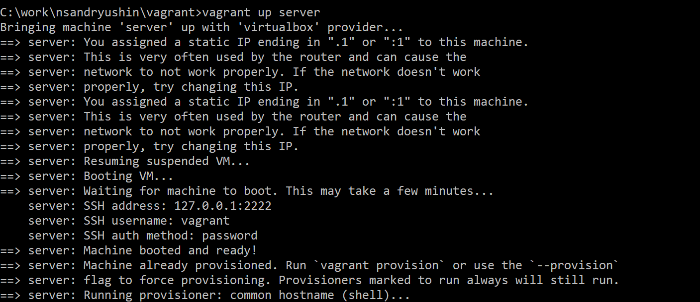{height=60%}

## Копирование конфигурационного файла

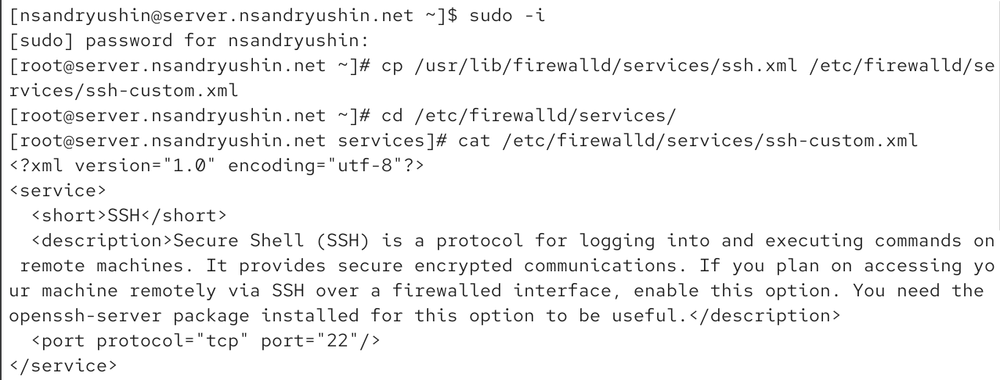{height=60%}

## Редактирование файла /etc/firewalld/services/ssh-custom.xml

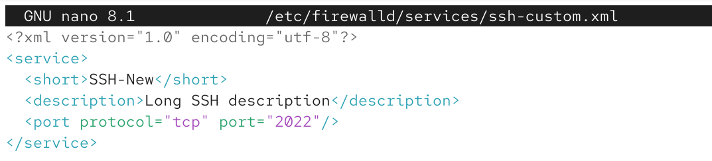{height=60%}

## Список служб firewalld

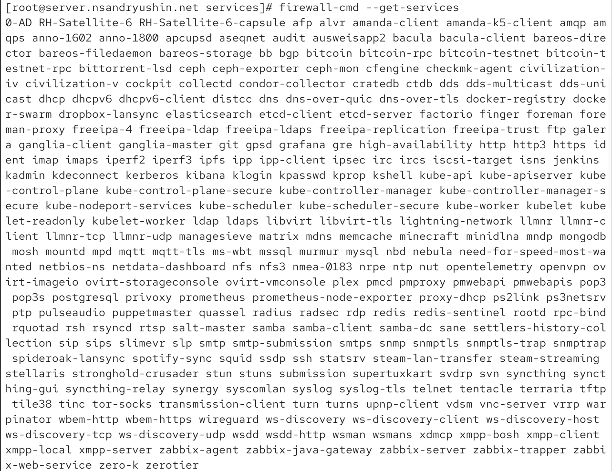{height=60%}

## Списки служб

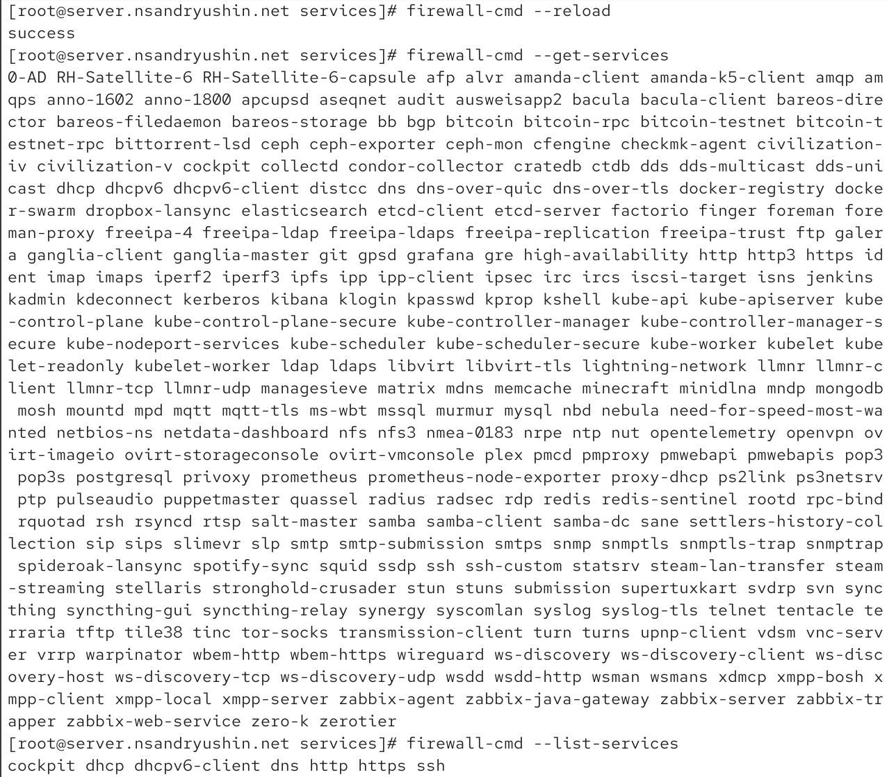{height=60%}

## Добавление службы как активной

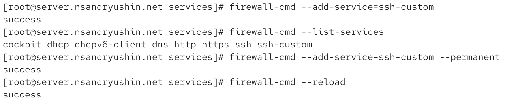{height=60%}

## Форвардинг портов

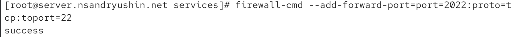{height=60%}

## Подключение по ssh

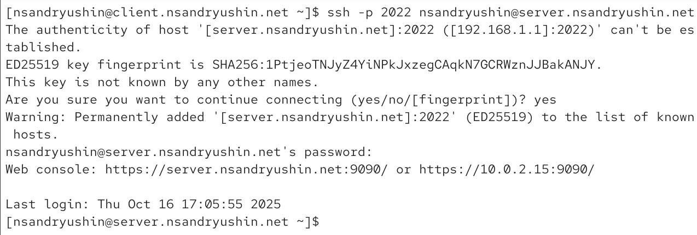{height=60%}

## Включение перенаправления и маскарадинга

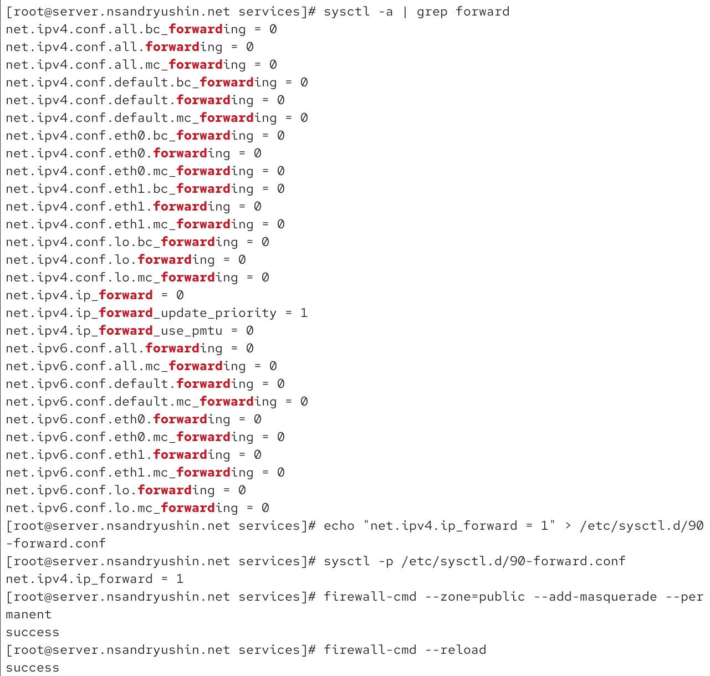{height=60%}

## Проверка доступа в интернет

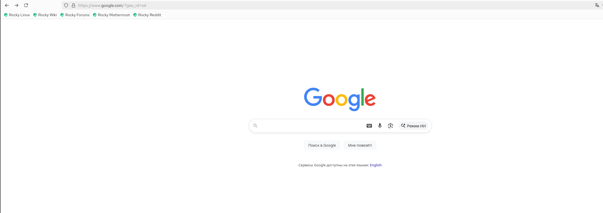{height=60%}

## Сохранение конфигурации vagrant

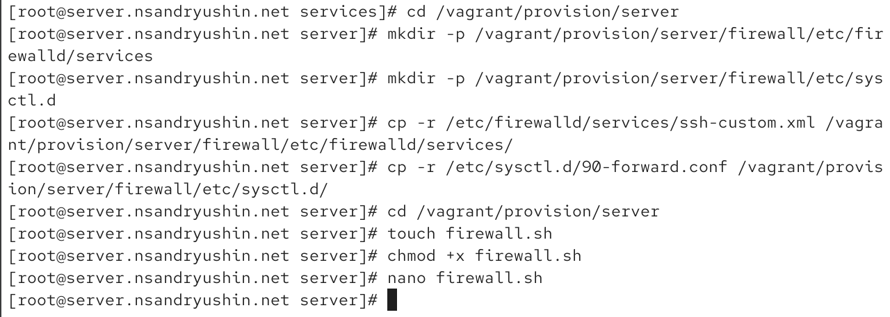{height=60%}

## firewall.sh

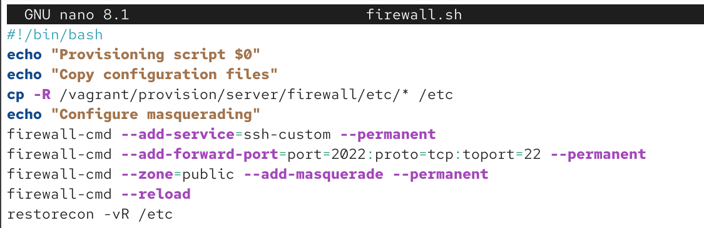{height=60%}

## Vagrantfile

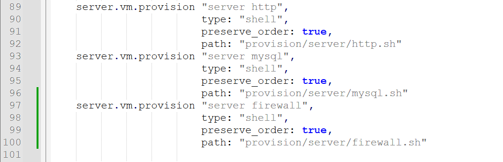{height=60%}

## Выводы

В результате выполнения лабораторной работы были получены навыки работы с фаерволом и настройкой форвардинга и маскарадинга
