---
## Front matter
lang: ru-RU
title: Лабораторная работа
subtitle: Номер 12
author:
  - Андрюшин Н. С. 
institute:
  - Российский университет дружбы народов, Москва, Россия
date: 01 января 1970

## i18n babel
babel-lang: russian
babel-otherlangs: english

## Formatting pdf
toc: false
toc-title: Содержание
slide_level: 2
aspectratio: 169
section-titles: true
theme: metropolis
header-includes:
 - \metroset{progressbar=frametitle,sectionpage=progressbar,numbering=fraction}

## Fonts
mainfont: IBM Plex Serif
romanfont: IBM Plex Serif
sansfont: IBM Plex Sans
monofont: IBM Plex Mono
mathfont: STIX Two Math
mainfontoptions: Ligatures=Common,Ligatures=TeX,Scale=0.94
romanfontoptions: Ligatures=Common,Ligatures=TeX,Scale=0.94
sansfontoptions: Ligatures=Common,Ligatures=TeX,Scale=MatchLowercase,Scale=0.94
monofontoptions: Scale=MatchLowercase,Scale=0.94,FakeStretch=0.9
mathfontoptions:
---

# Информация

## Докладчик

:::::::::::::: {.columns align=center}
::: {.column width="70%"}

  * Андрюшин Никита Сергеевич
  * Студент
  * Российский университет дружбы народов

:::
::: {.column width="30%"}

:::
::::::::::::::

## Цель работы

Получение навыков по управлению системным временем и настройке синхронизации времени

## Вывод команды timedatectl на сервере

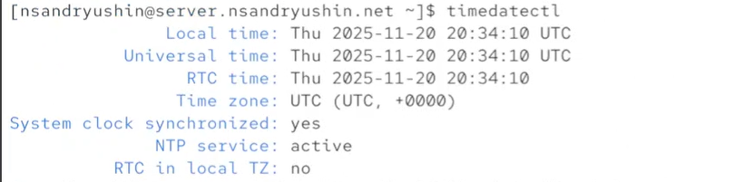{height=60%}

## Просмотр свойств времени с помощью timedatectl show

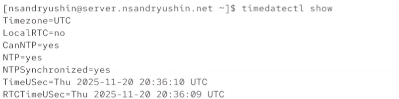{height=60%}

## Вывод команды timedatectl на клиенте

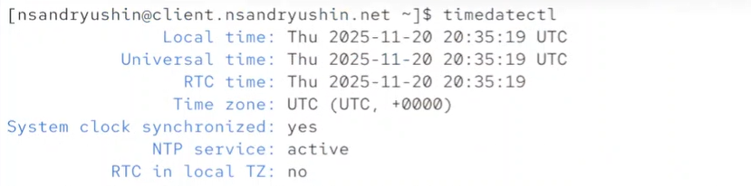{height=60%}

## Эксперименты с параметрами команды date на сервере

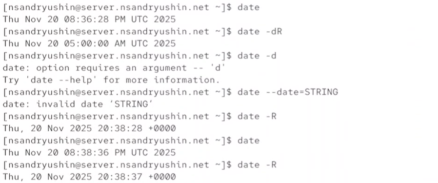{height=60%}

## Просмотр системного времени на клиенте

{height=60%}

## Просмотр аппаратного времени на сервере

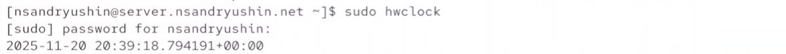{height=60%}

## Просмотр аппаратного времени на клиенте

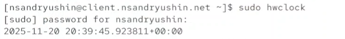{height=60%}

## Просмотр источников времени на сервере

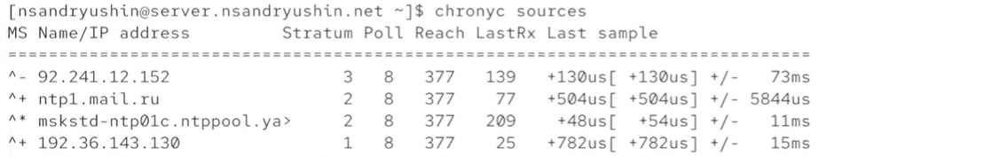{height=60%}

## Просмотр источников времени на клиенте

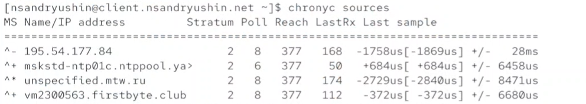{height=60%}

## Настройка доступа к NTP-серверу для локальной сети

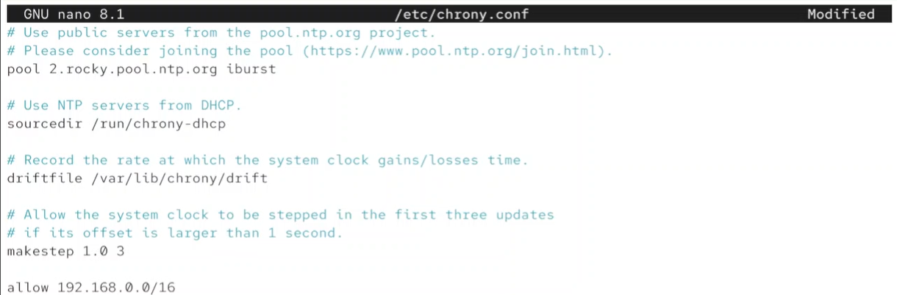{height=60%}

## Перезапуск службы и настройка Firewall на сервере

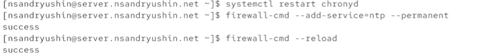{height=60%}

## Настройка клиента на использование локального NTP-сервера

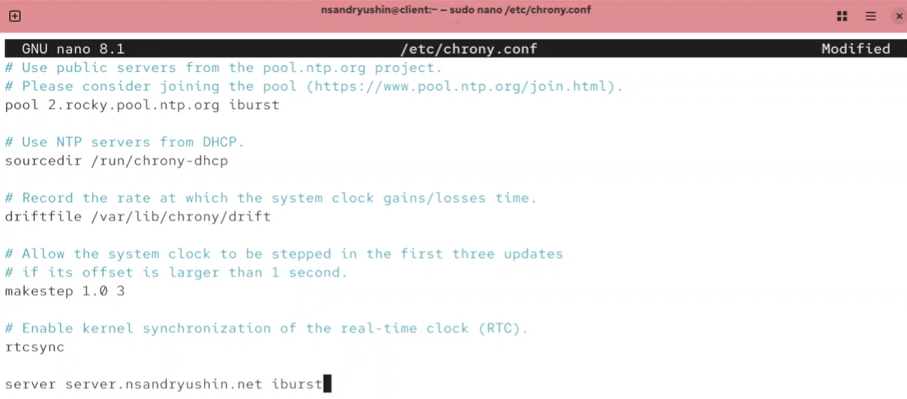{height=60%}

## Перезапуск службы chronyd на клиенте

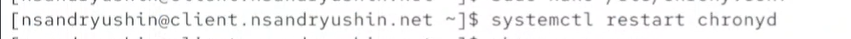{height=60%}

## Проверка источников времени на сервере

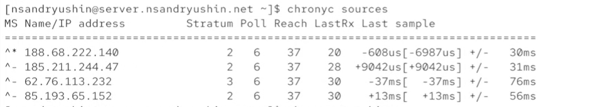{height=60%}

## Проверка источников времени на клиенте

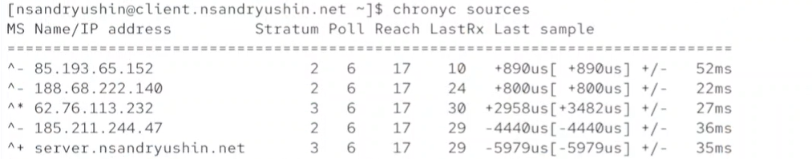{height=60%}

## Просмотр детальной информации о синхронизации на сервере

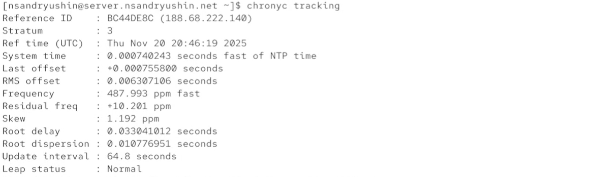{height=60%}

## Vagrant

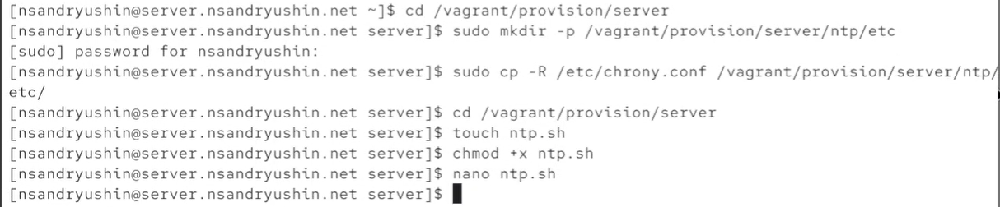{height=60%}

## Содержимое скрипта настройки ntp.sh для сервера

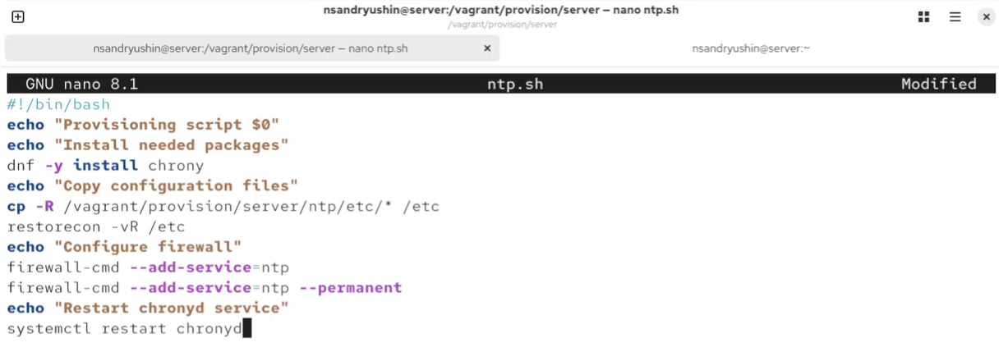{height=60%}

## Vagrant

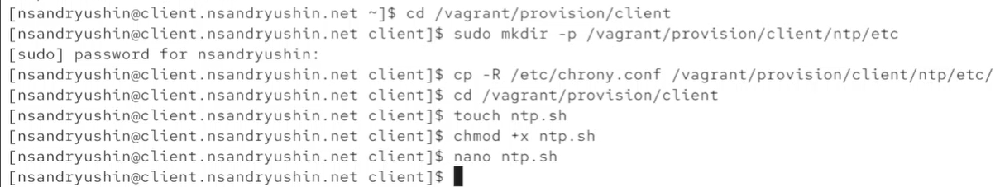{height=60%}

## Содержимое скрипта настройки ntp.sh для клиента

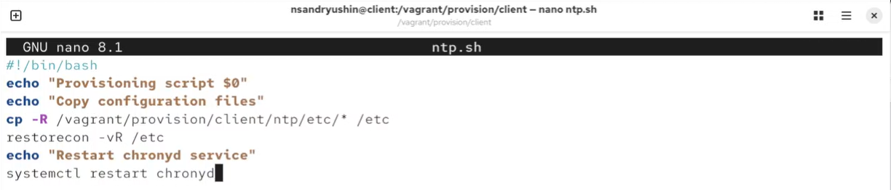{height=60%}

## Vagrantfile

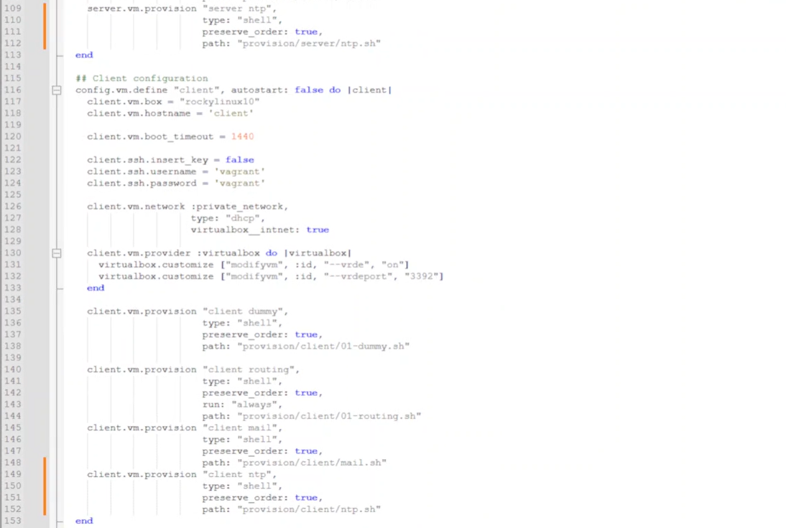{height=60%}

## Выводы

В результате выполнения лабораторной работы были получены навыки настройки системного времени и ntp синхронизации
