---
## Front matter
lang: ru-RU
title: Лабораторная работа
subtitle: Номер 14
author:
  - Андрюшин Н. С. 
institute:
  - Российский университет дружбы народов, Москва, Россия
date: 01 января 1970

## i18n babel
babel-lang: russian
babel-otherlangs: english

## Formatting pdf
toc: false
toc-title: Содержание
slide_level: 2
aspectratio: 169
section-titles: true
theme: metropolis
header-includes:
 - \metroset{progressbar=frametitle,sectionpage=progressbar,numbering=fraction}

## Fonts
mainfont: IBM Plex Serif
romanfont: IBM Plex Serif
sansfont: IBM Plex Sans
monofont: IBM Plex Mono
mathfont: STIX Two Math
mainfontoptions: Ligatures=Common,Ligatures=TeX,Scale=0.94
romanfontoptions: Ligatures=Common,Ligatures=TeX,Scale=0.94
sansfontoptions: Ligatures=Common,Ligatures=TeX,Scale=MatchLowercase,Scale=0.94
monofontoptions: Scale=MatchLowercase,Scale=0.94,FakeStretch=0.9
mathfontoptions:
---

# Информация

## Докладчик

:::::::::::::: {.columns align=center}
::: {.column width="70%"}

  * Андрюшин Никита Сергеевич
  * Студент
  * Российский университет дружбы народов

:::
::: {.column width="30%"}

:::
::::::::::::::

## Цель работы

Приобретение навыков настройки доступа групп пользователей к общим ресурсам по протоколу SMB.

## Установка пакетов Samba на сервере

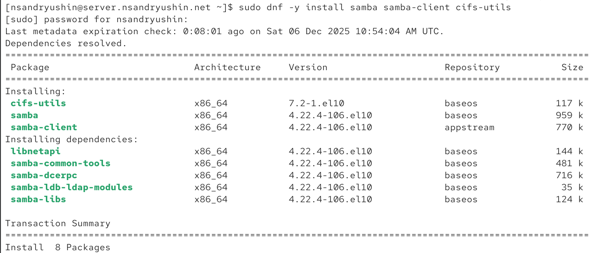{height=60%}

## Создание пользователей, групп и каталога

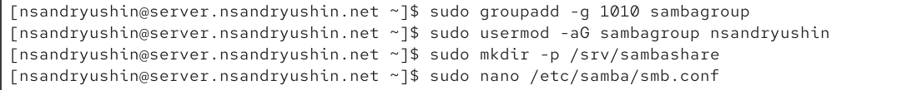{height=60%}

## Настройка smb.conf

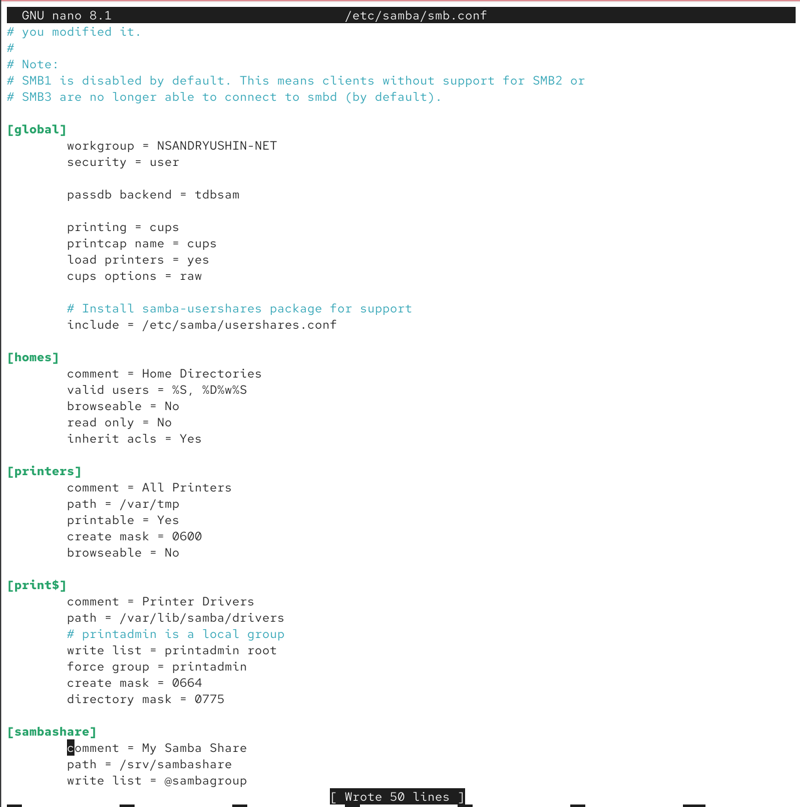{height=60%}

## Проверка конфигурации

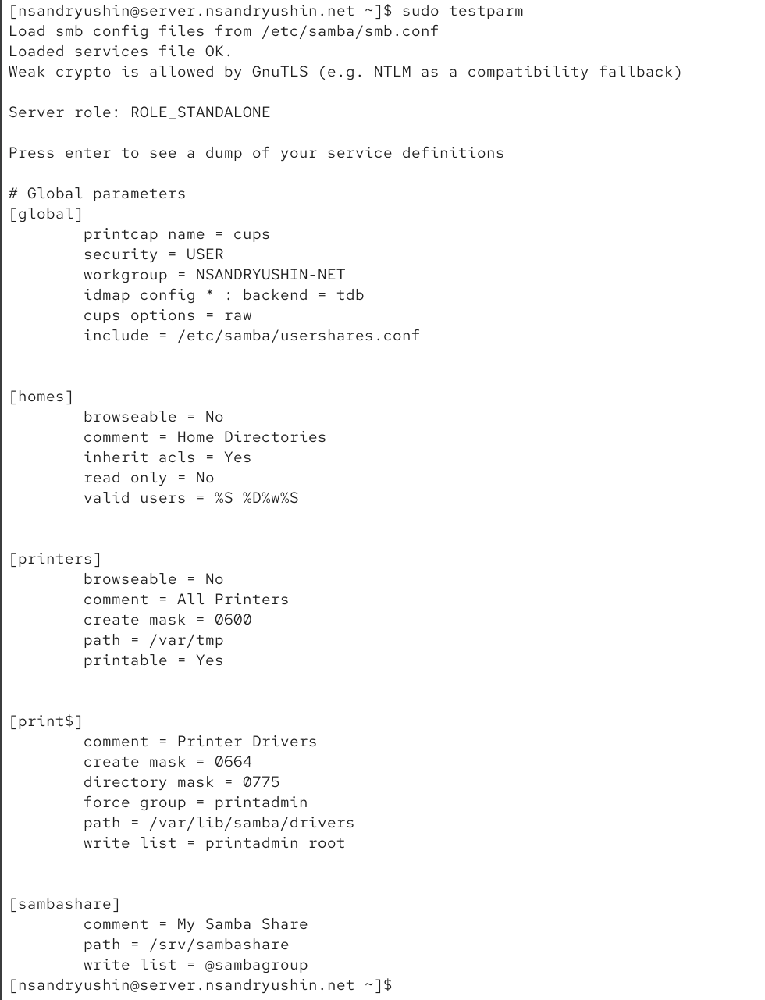{height=60%}

## Запуск службы SMB

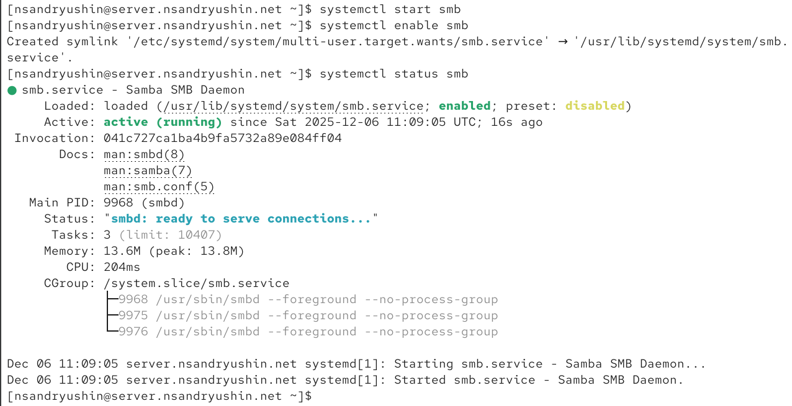{height=60%}

## Проверка доступа через smbclient

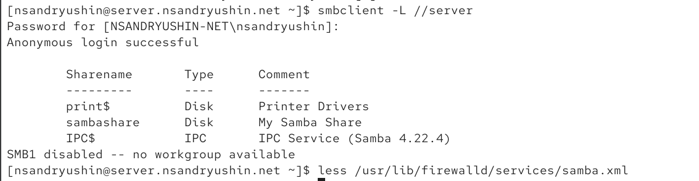{height=60%}

## Файл конфигурации службы samba.xml

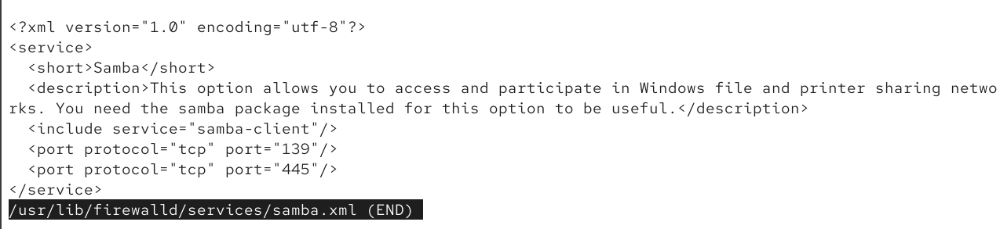{height=60%}

## Настройка Firewall и прав доступа

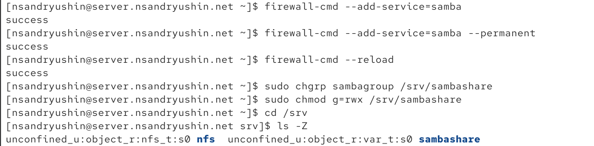{height=60%}

## Настройка контекста SELinux

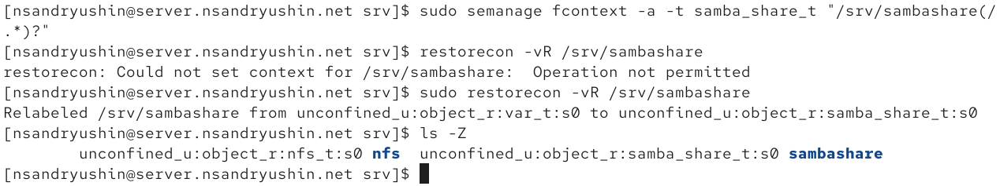{height=60%}

## Настройка boolean SELinux

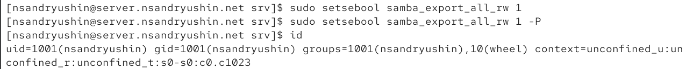{height=60%}

## Создание тестового файла и SMB-пользователя

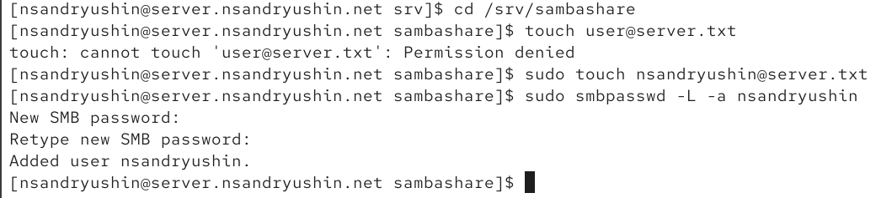{height=60%}

## Установка пакетов на клиенте

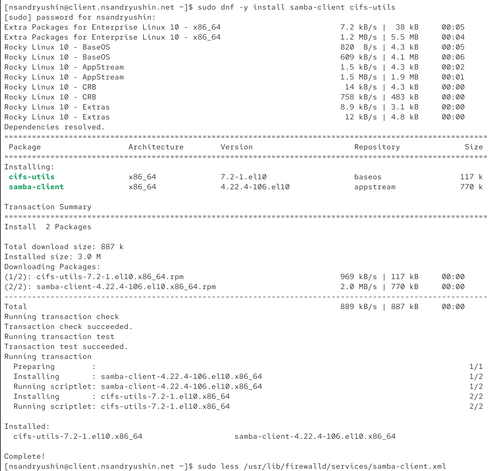{height=60%}

## Просмотр samba-client.xml

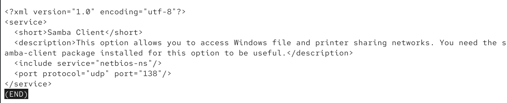{height=60%}

## Настройка окружения на клиенте

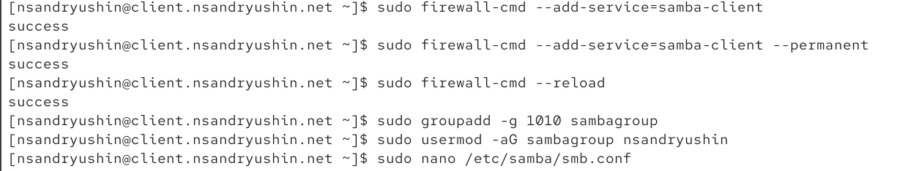{height=60%}

## Настройка рабочей группы на клиенте

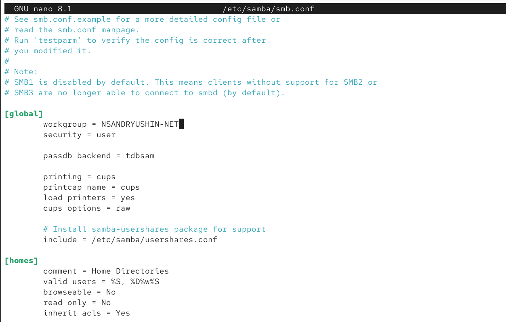{height=60%}

## Проверка списка ресурсов сервера с клиента

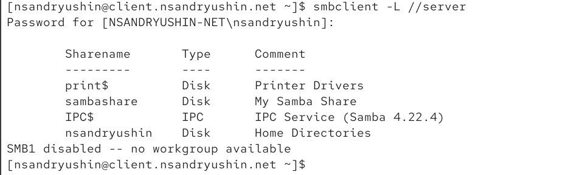{height=60%}

## Ручное монтирование и проверка записи

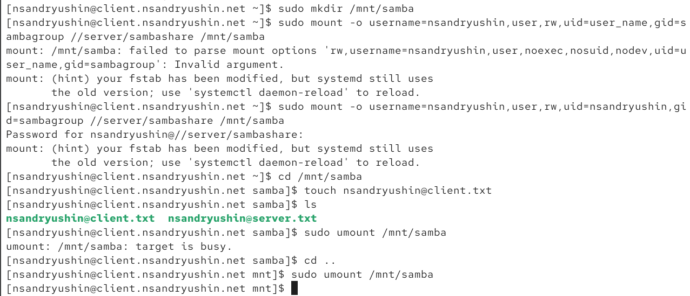{height=60%}

## Создание файла учетных данных

{height=60%}

## Содержимое файла smbusers

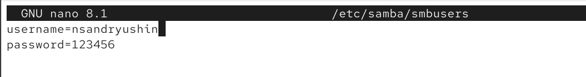{height=60%}

## Редактирование fstab

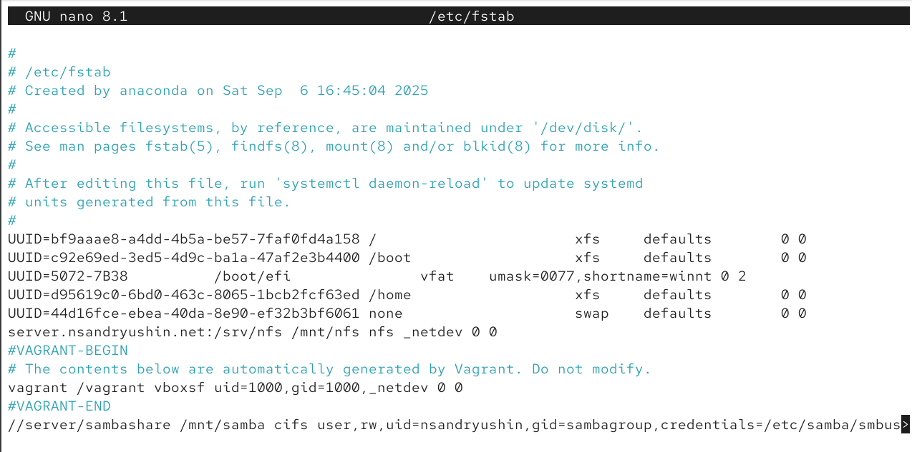{height=60%}

## Проверка автоматического монтирования

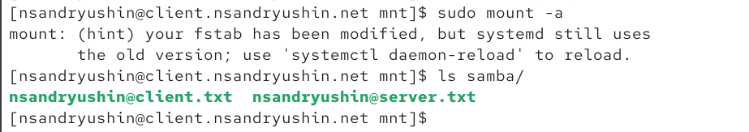{height=60%}

## Список файлов в общем ресурсе

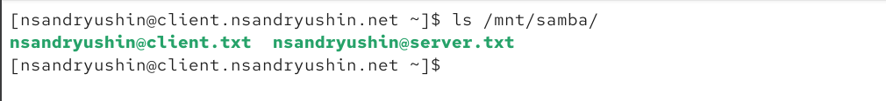{height=60%}

## Подготовка каталогов provision на сервере

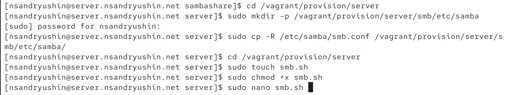{height=60%}

## Скрипт smb.sh для сервера

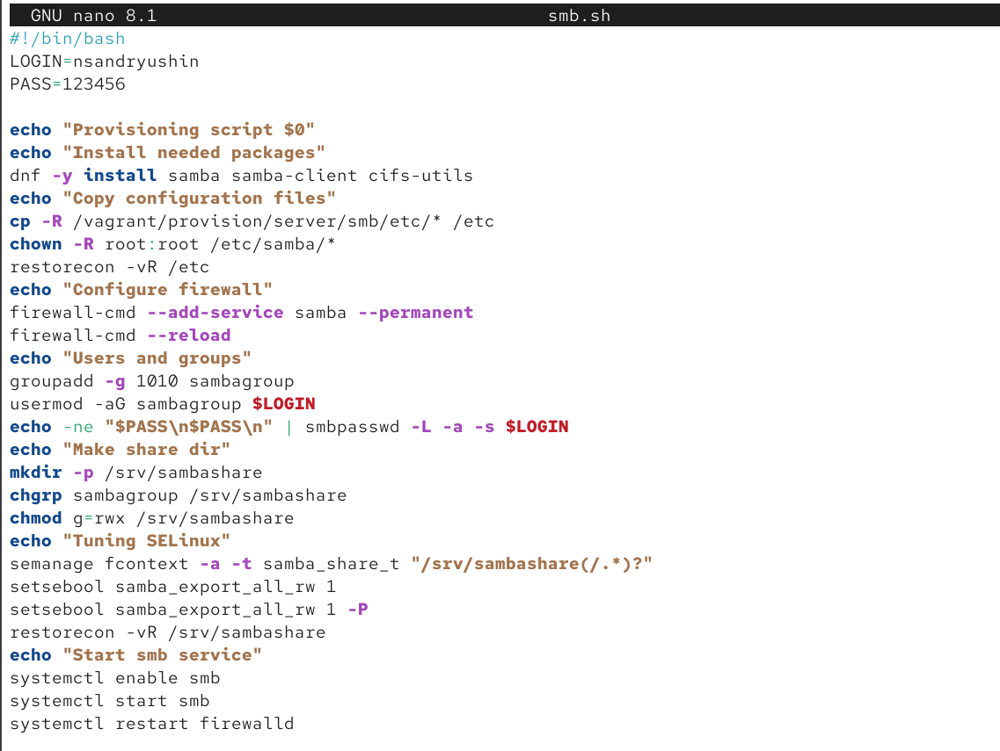{height=60%}

## Подготовка каталогов provision на клиенте

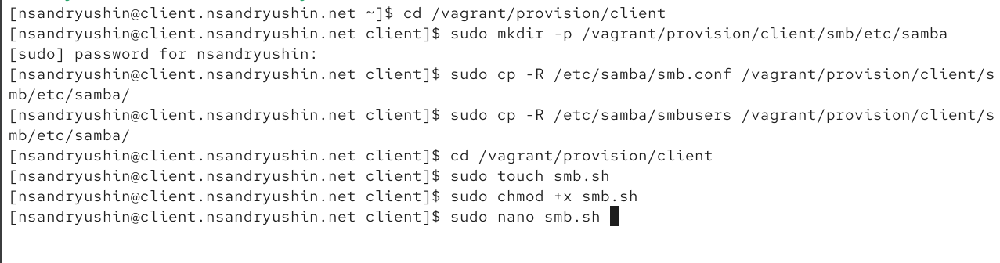{height=60%}

## Скрипт smb.sh для клиента

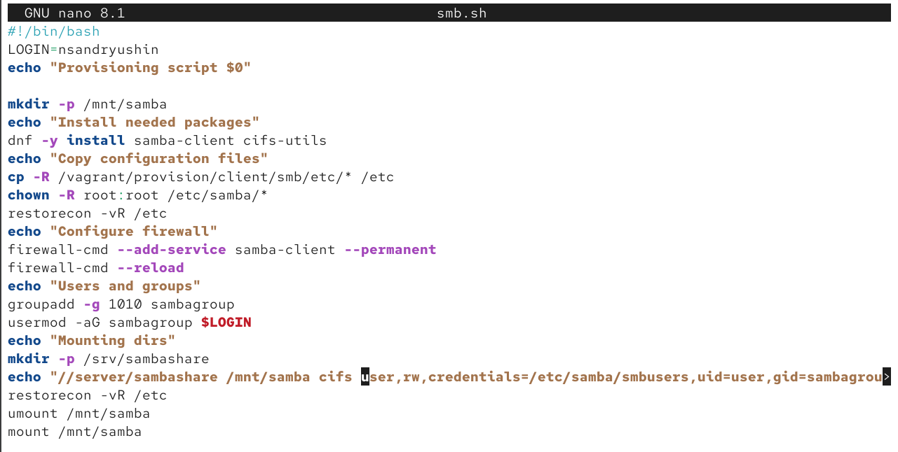{height=60%}

## Обновленный Vagrantfile

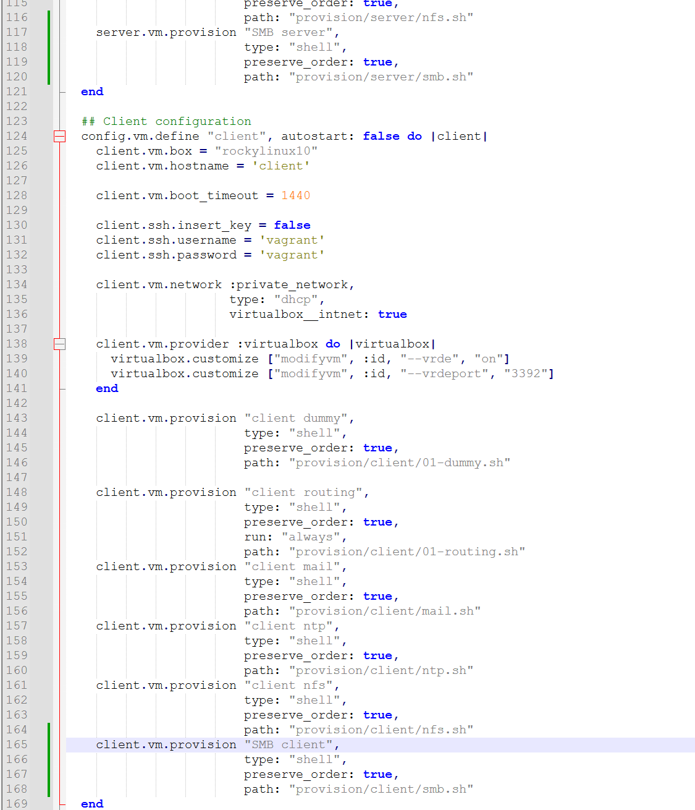{height=60%}

## Выводы

В результате выполнения лабораторной работы были получены навыки настройки и использования Samba
