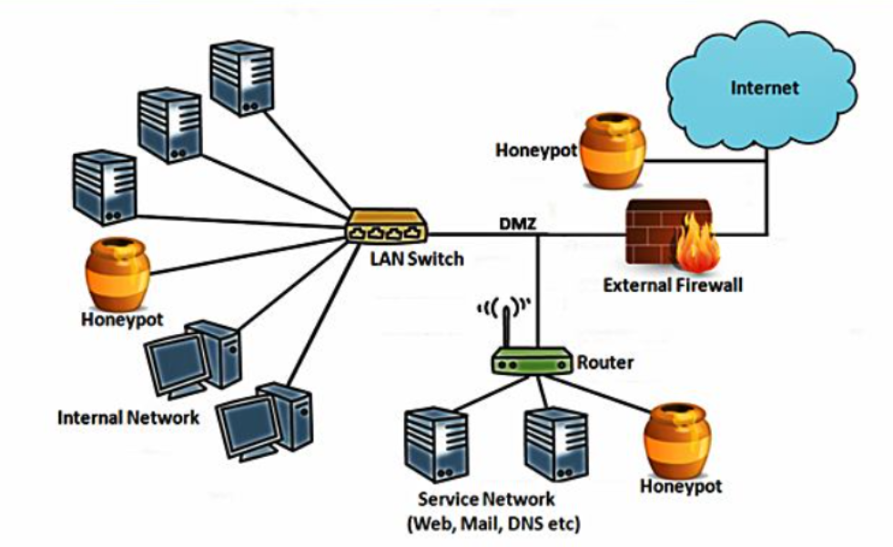

---
## Front matter
lang: ru-RU
title: Доклад
subtitle: Открытые реализации технологии Honeypot
author:
  - Андрюшин Н. С. 
institute:
  - Российский университет дружбы народов, Москва, Россия
date: 05 декабря 2025

## i18n babel
babel-lang: russian
babel-otherlangs: english

## Formatting pdf
toc: false
toc-title: Содержание
slide_level: 2
aspectratio: 169
section-titles: true
theme: metropolis
header-includes:
 - \metroset{progressbar=frametitle,sectionpage=progressbar,numbering=fraction}

## Fonts
mainfont: IBM Plex Serif
romanfont: IBM Plex Serif
sansfont: IBM Plex Sans
monofont: IBM Plex Mono
mathfont: STIX Two Math
mainfontoptions: Ligatures=Common,Ligatures=TeX,Scale=0.94
romanfontoptions: Ligatures=Common,Ligatures=TeX,Scale=0.94
sansfontoptions: Ligatures=Common,Ligatures=TeX,Scale=MatchLowercase,Scale=0.94
monofontoptions: Scale=MatchLowercase,Scale=0.94,FakeStretch=0.9
mathfontoptions:
---

# Информация

## Докладчик

:::::::::::::: {.columns align=center}
::: {.column width="70%"}

  * Андрюшин Никита Сергеевич
  * Студент
  * Российский университет дружбы народов

:::
::: {.column width="30%"}

:::
::::::::::::::

## Введение. Проблема защиты

Ограничения традиционных средств (Firewall, IPS, AV):   

Основаны на сигнатурах: эффективны только против известных угроз.   
Уязвимы перед целевыми атаками (APT) и эксплойтами «нулевого дня» (0-day).   
Проблема False Positives: огромное количество ложных срабатываний.   

Решение — Deception Technology (Технологии обмана):    

Переход к активной защите.   
Использование ловушек — Honeypot («горшочек с медом»).   
    
## Философия и принципы работы

:::::::::::::: {.columns align=center}
::: {.column width="70%"}

Фундаментальное определение:   
Honeypot — ресурс, ценность которого заключается исключительно в том, чтобы быть атакованным.   

Концепция отсутствия легитимности:   

Ресурс не выполняет бизнес-задач.   
Адрес не публикуется в DNS.   
Вывод: Любое взаимодействие (пакет, авторизация) = инцидент.   
Результат: Уровень ложных срабатываний стремится к нулю.   
    
:::
::: {.column width="30%"}    

:::
::::::::::::::

## Стратегические цели

Детектирование: Обнаружение злоумышленника, особенно на этапе горизонтального перемещения (lateral movement) внутри сети.   
Threat Intelligence: Сбор данных о новых тактиках и получение образцов вредоносного ПО.   
Замедление: Отвлечение ресурсов хакера и выигрыш времени для группы реагирования (SOC).   
    
# Открытые реализации    

## Эмуляция терминалов (SSH/Telnet)

:::::::::::::: {.columns align=center}
::: {.column width="70%"}

Эволюция: Kippo → Cowrie

Kippo (Python): Устарел, легко детектируется хакерами.   
Cowrie (актуален):   
Тип: Medium Interaction (средний уровень взаимодействия).   
Функции: Эмулирует файловую систему UNIX, дает выполнять команды (ls, wget).   
Особенность: Поддержка Telnet (актуально против IoT-ботнетов, напр. Mirai).   
Логирование: Запись сессии взлома для воспроизведения и анализа.   

:::
::: {.column width="30%"}

:::
::::::::::::::
    
## Перехват вредоносного ПО

:::::::::::::: {.columns align=center}
::: {.column width="70%"}

Эволюция: Nepenthes → Dionaea   

Назначение: Сбор самораспространяющихся червей и шифровальщиков.   
Принцип Dionaea:   
Эмулирует уязвимости в протоколах (SMB, HTTP, FTP, MSSQL).   
Не имитирует командную строку, а позволяет эксплуатировать «дыру».   
Цель: Перехват полезной нагрузки (payload/бинарного файла) для реверс-инжиниринга.   
Особенность: Поддержка IPv6.   

:::
::: {.column width="30%"}

:::
::::::::::::::
    
## Защита веб-приложений

:::::::::::::: {.columns align=center}
::: {.column width="70%"}

Эволюция: Glastopf → Snare/Tanner   

Glastopf: Монолитная архитектура, динамическая генерация ответов. Стал слишком тяжелым.   
Snare/Tanner (Микросервисный подход):   
Snare (Сенсор): Легкий клон веб-страницы, перенаправляет трафик.   
Tanner (Мозг): Анализирует события и формирует стратегию ответа.   
Преимущество: Возможность развернуть множество легких ловушек с единым центром.   

:::
::: {.column width="30%"}

:::
::::::::::::::

## Внутренняя разведка

:::::::::::::: {.columns align=center}
::: {.column width="70%"}

Проект OpenCanary (Thinkst Applied Research)   

Идеология: «Канарейка в шахте». Ориентирован на внутреннюю сеть предприятий, а не на исследования.   
Функционал: Набор демонов, имитирующих сервисы (Windows Share, SSH, HTTP).   
Задача: Не изучать хакера, а мгновенно оповестить администратора о попытке входа.   
Плюсы: Простота внедрения, отсутствие ложных тревог.   

:::
::: {.column width="30%"}

:::
::::::::::::::

## Комплексные платформы (T-Pot)

:::::::::::::: {.columns align=center}
::: {.column width="70%"}

Проблема: Сложность управления разрозненными ханипотами.   
Решение: T-Pot (Deutsche Telekom Security)   

Технология: Базируется на Docker-контейнерах.   
Состав: Объединяет Cowrie, Dionaea, Suricata и др.   
Аналитика: Встроенный стек ELK (Elasticsearch, Logstash, Kibana).   
Результат: Визуализация карты атак и статистики в реальном времени.   

:::
::: {.column width="30%"}

:::
::::::::::::::

## Заключение

Эволюция: Open Source сообщество успешно адаптирует инструменты (от скриптов к микросервисам и Docker).   
Смена парадигмы: Переход от реактивной защиты к проактивной (изучение врага).   
Важно: Ханипот — это дополнение, а не замена традиционных средств. Требует аккуратной настройки, чтобы не стать плацдармом для атаки.   

## Список источников

Spitzner L. «Honeypots: Tracking Hackers».   
Provos N., Holz T. «Virtual Honeypots».   
Официальная документация Cowrie (cowrie.readthedocs.io).   
Репозиторий T-Pot Community Edition (GitHub).   
Материалы The Honeynet Project.   
Oosterhof M. «The transformation of Kippo into Cowrie».   

