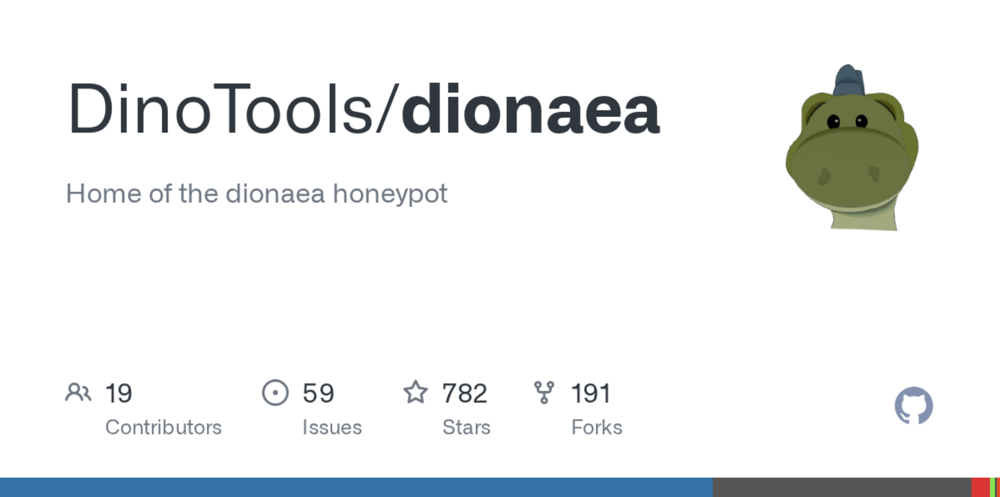
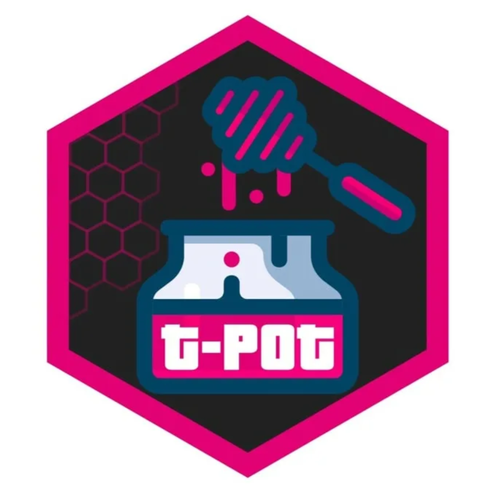

---
## Front matter
title: "Доклад"
subtitle: "Открытые реализации технологии Honeypot"
author: "Андрюшин Никита Сергеевич"

## Generic otions
lang: ru-RU
toc-title: "Содержание"

## Bibliography
bibliography: bib/cite.bib
csl: pandoc/csl/gost-r-7-0-5-2008-numeric.csl

## Pdf output format
toc: true # Table of contents
toc-depth: 2
lof: true # List of figures
lot: true # List of tables
fontsize: 12pt
linestretch: 1.5
papersize: a4
documentclass: scrreprt
## I18n polyglossia
polyglossia-lang:
  name: russian4
  options:
	- spelling=modern
	- babelshorthands=true
polyglossia-otherlangs:
  name: english
## I18n babel
babel-lang: russian
babel-otherlangs: english
## Fonts
mainfont: IBM Plex Serif
romanfont: IBM Plex Serif
sansfont: IBM Plex Sans
monofont: IBM Plex Mono
mathfont: STIX Two Math
mainfontoptions: Ligatures=Common,Ligatures=TeX,Scale=0.94
romanfontoptions: Ligatures=Common,Ligatures=TeX,Scale=0.94
sansfontoptions: Ligatures=Common,Ligatures=TeX,Scale=MatchLowercase,Scale=0.94
monofontoptions: Scale=MatchLowercase,Scale=0.94,FakeStretch=0.9
mathfontoptions:
## Biblatex
biblatex: true
biblio-style: "gost-numeric"
biblatexoptions:
  - parentracker=true
  - backend=biber
  - hyperref=auto
  - language=auto
  - autolang=other*
  - citestyle=gost-numeric
## Pandoc-crossref LaTeX customization
figureTitle: "Рис."
tableTitle: "Таблица"
listingTitle: "Листинг"
lofTitle: "Список иллюстраций"
lotTitle: "Список таблиц"
lolTitle: "Листинги"
## Misc options
indent: true
header-includes:
  - \usepackage{indentfirst}
  - \usepackage{float} # keep figures where there are in the text
  - \floatplacement{figure}{H} # keep figures where there are in the text
---

# Введение

В условиях современной цифровизации и экспоненциального роста киберпреступности традиционные методы защиты информации, такие как межсетевые экраны, системы предотвращения вторжений (IPS) и антивирусное программное обеспечение, сталкиваются с рядом ограничений. Классические средства защиты работают преимущественно на основе сигнатурного анализа и правил блокировки, что делает их эффективными против известных угроз, но часто бесполезными перед лицом целенаправленных атак (APT) и угроз «нулевого дня». Кроме того, администраторы безопасности сталкиваются с проблемой огромного количества ложных срабатываний, что усложняет выявление реальных инцидентов.

В связи с этим актуальность приобретают методы активной защиты и технологии обмана (Deception Technology), ярким представителем которых являются системы Honeypot («ханипот», дословно «горшочек с медом»). Данная работа посвящена анализу открытых (Open Source) программных реализаций этой технологии.

Целью работы является изучение архитектуры, функциональных возможностей и эволюции популярных открытых решений класса Honeypot, а также определение их роли в современной экосистеме информационной безопасности.

# Теоретические основы и философия технологии Honeypot

Для глубокого понимания предмета исследования необходимо определить фундаментальный принцип работы ханипотов, который отличает их от стандартных средств защиты. Honeypot — это ресурс безопасности (сервер, сетевая служба или информационный массив), ценность которого заключается исключительно в том, чтобы быть подвергнутым атаке или компрометации.

Философия технологии строится на концепции отсутствия легитимной активности. Ханипот не выполняет производственных задач, его адрес не публикуется в DNS для пользователей, и сотрудники организации не имеют причин обращаться к данному ресурсу. Следовательно, любое взаимодействие с ханипотом (сетевой пакет, попытка авторизации, запрос файла) по определению является несанкционированным и подозрительным. Это позволяет свести уровень ложных срабатываний практически к нулю, предоставляя администратору безопасности чистый сигнал о наличии угрозы.

Глобально внедрение подобных ловушек преследует три стратегические цели. Во-первых, это детектирование присутствия злоумышленника в сети, особенно на этапах горизонтального перемещения (lateral movement), когда периметральная защита уже преодолена. Во-вторых, это сбор данных об угрозах (Threat Intelligence): получение образцов нового вредоносного ПО и изучение тактик атакующих. В-третьих, это отвлечение ресурсов злоумышленника, замедление его продвижения и выигрыш времени для группы реагирования на инциденты.

# Эволюция и анализ открытых реализаций (Open Source)

Рынок открытого программного обеспечения предлагает широкий спектр инструментов, каждый из которых прошел длительный путь эволюционного развития. Рассмотрим наиболее значимые из них.

## Эмуляция терминального доступа: от Kippo к Cowrie

Одним из самых распространенных векторов атак является подбор паролей к сервисам удаленного управления. Долгое время стандартом в этой области был проект Kippo, написанный на Python. Однако к началу 2010-х годов он перестал отвечать требованиям скрытности, так как злоумышленники научились распознавать его по специфическим ответам. На смену ему пришел проект Cowrie, разработанный Мишелем Остерхофом.

Cowrie представляет собой ханипот со средним уровнем взаимодействия (Medium Interaction). Он эмулирует файловую систему UNIX, позволяя злоумышленнику «войти» в систему, выполнять команды (ls, cd, wget) и даже скачивать файлы. Важным нововведением Cowrie по сравнению с предшественником стала поддержка не только протокола SSH, но и Telnet, что стало ответом на рост ботнетов, атакующих IoT-устройства (например, Mirai). Система позволяет записывать сессию взлома в формате, пригодном для последующего воспроизведения, что дает исследователям возможность визуально анализировать действия хакера.

## Перехват вредоносного ПО: наследие Nepenthes и Dionaea

Для сбора образцов самораспространяющегося вредоносного ПО (червей, шифровальщиков) используются специализированные ловушки. Исторически эту нишу занимал проект Nepenthes, однако с развитием сетевых технологий он устарел. Его идеологическим наследником стал ханипот Dionaea.

Dionaea эмулирует уязвимости в различных сетевых протоколах (SMB, HTTP, FTP, MSSQL, VoIP). Ключевая особенность данного решения заключается не в имитации командной строки, а в имитации уязвимой среды. Система намеренно позволяет атакующему эксплуатировать известные уязвимости, но вместо заражения системы перехватывает передаваемую полезную нагрузку (payload). Это делает Dionaea идеальным инструментом для автоматического сбора бинарных файлов вирусов для их последующего реверс-инжиниринга и обновления баз сигнатур. Также стоит отметить поддержку протокола IPv6, что было важным шагом в развитии проекта.

## Веб-уязвимости: трансформация Glastopf в архитектуру Snare/Tanner

В сфере защиты веб-приложений долгое время доминировал проект Glastopf, созданный Лукасом Ристом. Его революционная идея заключалась в динамической генерации ответов на атаки (например, SQL-инъекции), чтобы убедить хакера в успешности взлома. Однако монолитная архитектура Glastopf со временем стала слишком ресурсоемкой и сложной для поддержки.

Современная реализация идей Glastopf нашла отражение в разделенной архитектуре проектов Snare и Tanner. Данный подход соответствует принципам микросервисов: Snare выступает в роли легкого веб-сенсора, который клонирует существующую страницу и перенаправляет трафик, в то время как Tanner является «мозгом» системы, анализирующим события и формирующим стратегию ответа. Это позволяет разворачивать множество легких ловушек с единым центром управления.

## Внутренняя разведка: концепция OpenCanary

Особое место занимает проект OpenCanary от компании Thinkst Applied Research. В отличие от вышеописанных исследовательских инструментов, OpenCanary ориентирован на прагматичную защиту внутренней сети предприятий. Идеология проекта отсылает к практике использования канареек в шахтах для раннего обнаружения опасных газов.

OpenCanary представляет собой набор демонов, имитирующих различные сервисы (Windows File Share, HTTP, SSH) внутри периметра сети. Инструмент не предназначен для глубокого анализа действий хакера; его единственная задача — мгновенно оповестить администратора о попытке подключения. Это решение отличается простотой развертывания и крайне низким уровнем ложных срабатываний, что делает его доступным для организаций с ограниченными ресурсами безопасности.

# Комплексные платформы агрегации (T-Pot)

Внедрение и администрирование разрозненных ханипотов требует высокой квалификации персонала и значительных трудозатрат. Для решения этой проблемы создаются агрегаторы — платформы «все в одном». Наиболее известным решением такого класса является T-Pot, разрабатываемый подразделением Deutsche Telekom Security.

T-Pot базируется на технологии контейнеризации Docker, объединяя в себе множество популярных ханипотов (включая Cowrie, Dionaea, Suricata и другие) в единую экосистему. Главным преимуществом платформы является встроенный стек ELK (Elasticsearch, Logstash, Kibana), который обеспечивает сбор, нормализацию и визуализацию логов. Это позволяет аналитику видеть карту атак в реальном времени, статистику по используемым эксплойтам и учетным данным, не погружаясь в настройку каждого отдельного компонента. T-Pot делает технологию доступной для широкого круга исследователей и образовательных учреждений.

# Заключение

Проведенный анализ показывает, что открытые реализации технологии Honeypot представляют собой мощный и гибкий инструментарий для обеспечения информационной безопасности. Эволюция решений от простых скриптов (Kippo, Nepenthes) до сложных распределенных систем (T-Pot, Snare/Tanner) демонстрирует способность сообщества Open Source адаптироваться к изменяющемуся ландшафту киберугроз.

Использование рассмотренных инструментов (Cowrie, Dionaea, OpenCanary) позволяет организациям перейти от реактивной модели защиты к проактивной: изучать врага, собирать уникальные данные об атаках и выявлять инциденты на ранних стадиях. Вместе с тем, внедрение ханипотов требует осознанного подхода, так как неправильно настроенная ловушка может стать плацдармом для реальной атаки на инфраструктуру. Таким образом, ханипоты являются эффективным дополнением к традиционным средствам защиты, но не могут полностью их заменить.

# Список используемых источников

Spitzner L. Honeypots: Tracking Hackers. — Addison-Wesley Professional, 2002.   
Provos N., Holz T. Virtual Honeypots: From Botnet Tracking to Intrusion Detection. — Addison-Wesley, 2007.   
Официальная документация проекта Cowrie [Электронный ресурс]. URL: https://cowrie.readthedocs.io/   
Репозиторий платформы T-Pot Community Edition [Электронный ресурс]. URL: https://github.com/telekom-security/tpotce   
Материалы сообщества The Honeynet Project [Электронный ресурс]. URL: https://www.honeynet.org/   
Oosterhof M. The transformation of Kippo into Cowrie // Proceedings of the Honeynet Project Workshop. — 2015.   
